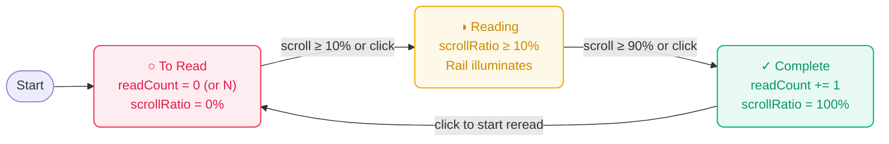

# Portable File-Based Reading Tracker, Article Table View, and Scroll Auto-Detection

## Goal

1. **Primary Goal**: Provide a portable, file-based reading tracker persisted directly on disk (`content/reading_state.json`) that can be transferred across machines simply by copying the folder or committing to Git.
2. **Secondary Goals**:
   - **Consolidated Master Library**: Consolidate the reader homepage (`/`) into a comprehensive, searchable, sortable data table with stats, author filtering, status tabs, and reading status controls.
   - **Homepage Stepped Glass Progress**: Render a subtle, translucent light teal glass-effect background fill (`rgba(45, 212, 191, 0.08)` to `rgba(20, 184, 166, 0.11)` with backdrop blur) across each article row in 5% increments based on reading progress.
   - **Left Progress Rail**: Provide a vertical ladder of 20 discrete horizontal dash segments (in 5% increments) fixed to the left of article pages that illuminate sequentially and allow jump-to-section navigation.
   - **Accurate Prose Scroll Auto-Detection & Smooth Position Resume**: Measure actual `#prose-content` scroll progress with `requestAnimationFrame`, automatically transitioning from `pending` $\to$ `in-progress` at $\ge 10\%$ and `in-progress` $\to$ `completed` at $\ge 90\%$, restoring previous reading position with a smooth 160ms settling glide on return, with bottom-left floating toast feedback.

---

## Background & Architecture

### 1. Portable Disk-Based Storage (`content/reading_state.json`)

Instead of trapping reading state inside browser `localStorage` (which requires manual export/import and is lost across browsers or devices), reading progress is stored directly inside the repository:

```text
content/
├── reading_state.json               # Master reading status & progress file
├── <author-1>/
│   ├── posts/
│   └── metadata.json
└── ...
```

#### Why `content/reading_state.json`?
- **Zero Binary Setup**: Unlike SQLite or DuckDB, plain JSON requires no platform-specific C-bindings or build toolchains on Windows/macOS/Linux.
- **Portability**: Copying the project directory or syncing via Git transfers all reading history seamlessly across machines.
- **Dual Access**:
  - **Astro Reader**: Reads on page load / build, and updates via dev server API route (`/api/reading-status`).
  - **Python Scraper / CLI**: Can easily inspect, query, or batch-update reading statistics directly.

#### Schema
Each record is keyed by the unique post ID / slug path (e.g. `pragmaticengineer/posts/what-is-happening-with-code-reviews`):
```json
{
  "pragmaticengineer/posts/what-is-happening-with-code-reviews": {
    "status": "in-progress",
    "scrollRatio": 0.5,
    "updatedAt": "2026-09-19T09:05:00.000Z",
    "completedAt": "2026-09-19T09:15:30.000Z"
  }
}
```

---

### 2. Left Progress Rail (`reader/src/components/ProgressRail.astro`)

- **Visual Design**: Fixed vertical column of 20 discrete horizontal dashes (in 5% increments) positioned to the left of the article prose on desktop screens ($\ge 960\text{px}$). Major (10%) and minor (5%) ticks share identical 1.5px thickness, with minor ticks narrower (6px vs 12px).
- **Sequential Illumination**: As the reader scrolls through `#prose-content`, dashes illuminate sequentially from top to bottom.
- **Interactive Navigation**: Clicking any dash smoothly scrolls the reader directly to that section (5%, 10%, 15%, ..., 100%) of the article.
- **Tooltips**: Hovering over any dash displays the exact target percentage.

---

### 3. Prose Scroll Auto-Detection & Floating Feedback (`reader/src/layouts/PostLayout.astro`)

Reading progress is calculated directly from article prose geometry using `requestAnimationFrame`:

1. **Focal Line Geometry**:
   $$\text{ratio} = \frac{\text{window.scrollY} + \text{window.innerHeight} \times 0.6 - \text{proseTop}}{\text{proseHeight}}$$
   Using a 60% viewport reading focal line matching human reading gaze heuristics.
2. **Auto-Start (`in-progress`)**:
   - Triggered when reading reaches $\ge 10\%$ of prose.
   - Transitions status from `pending` $\to$ `in-progress` and displays a subtle floating glass toast: *"◑ Reading"*.
3. **Auto-Finish (`completed`)**:
   - Triggered when reaching $\ge 90\%$ of prose.
   - Transitions status to `completed`, records `completedAt` timestamp, and displays a floating glass toast: *"✓ Completed"*.
4. **Automatic Reading Position Resume with Smooth Settling Glide**:
   - When an article in `in-progress` state ($\ge 8\%$) is opened, `ProgressRail.astro` illuminates the rail ticks immediately for instant spatial feedback, pauses for a brief 160ms settling buffer to let DOM/font metrics settle, and then smoothly glides (`window.scrollTo({ behavior: 'smooth' })`) to the exact section where the reader left off, displaying a toast: *"📖 Resumed at X%"*.
   - Auto-cancelled if the user manually scrolls (`scrollY > 40`) or clicks a rail tick before the 160ms timer fires.
   - Honors `prefers-reduced-motion` with instant positioning.
   - Completed articles start fresh from the top (0%).
5. **Debounced Disk Persistence with Keepalive Flush**:
   - Accumulates progress updates and flushes debounced to `/api/reading-status` (1-second / 1000ms window) to prevent disk I/O thrashing during scrolling.
   - Registers `keepalive: true` flush listeners on `pagehide`, `beforeunload`, and when clicking the Home button, ensuring reading progress is never dropped when navigating away.
6. **Manual Overrides**:
   - Readers can click `<ReadingStatusButton />` in `.post-top-nav` or the library table to cycle `To Read` $\to$ `Reading` $\to$ `Complete` $\to$ `To Read`.
   - Event listeners use delegated handling with idempotency guards to prevent accidental double-jumps.

---

### 4. Consolidated Master Library & Stepped Glass Progress (`reader/src/pages/index.astro`)

The homepage (`/`) serves as the primary master library:
- **Stats Card**: Real-time counts of Total Articles, To Read (Red), Reading (Yellow), Completed (Green), Total Reads (all completed reads + rereads), and an animated progress bar.
- **Status Tabs**: Instant tab switching between `All`, `To Read`, `Reading`, and `Done`.
- **Search & Author Filter**: Instant client-side search across titles, descriptions, authors, and tags.
- **Sortable Columns**: Sort by Status / Read Count, Title, Author, Date, or Read Time.
- **5% Stepped Teal Glass Fill**:
  - Each `.article-row` features a subtle, translucent light teal glass background:
    ```css
    background: linear-gradient(
      90deg,
      rgba(45, 212, 191, 0.08) 0%,
      rgba(20, 184, 166, 0.11) var(--row-progress),
      transparent var(--row-progress)
    );
    backdrop-filter: blur(6px);
    ```
  - Pre-calculated at build/load from `content/reading_state.json` and updated reactively whenever client status changes.

---

### 5. Dual Rail Architecture on Post Pages (`reader/src/layouts/PostLayout.astro`)

Article pages provide a dual-rail reading experience:
- **Left Side (Reading Progress Rail)**: 20 discrete dashes in 5% increments (`ProgressRail.astro`) tracking overall reading completion percentage with click-to-scroll navigation and scroll position resume. Major (10%) and minor (5%) ticks share identical 1.5px thickness, with minor ticks narrower (6px vs 12px). Positioned flush to the viewport margin (`clamp(20px, 2.5vw, 36px)`) and vertically centered (`top: 50%; transform: translateY(-50%)`). Active on screens $\ge 960\text{px}$.
- **Right Side (Table of Contents Rail)**: Heading outline (`toc-rail` via `reading-rail.ts`) showing H2/H3 section structure on viewports $\ge 960\text{px}$ (synchronized with left rail, lowered from previous 1220px limit). Displays immediately with `hideBefore: false`, vertically centered (`top: 50%; transform: translateY(-50%)`), and dynamically scales to 140px on intermediate viewports ($960\text{px} - 1220\text{px}$) to fit comfortably within the right margin.

---

### 6. Reread Cycle & Read Count Tracking (`reader/src/scripts/reading-tracker.ts`)

Some articles are worth rereading multiple times. When a reader finishes an article and wants to read it again, clicking the status button from **Complete** to **To Read** archives the completed read, preserves the total count, resets progress to 0%, and tracks the subsequent read.



- **Read Count Multiplier**:
  - `readCount` is persisted to `content/reading_state.json`. Completed articles without an explicit count default to `1`.
  - Displayed prominently inside `<ReadingStatusButton />` with state-tinted `.read-count-badge`:
    - Multiple completions: `[✓ Complete | 2×]`
    - Queued for reread: `[○ To Read | 1×]`
    - Actively rereading: `[◑ Reading | 1×]`
- **Reactive UI Synchronization**:
  - Cycling from `Complete` $\to$ `To Read` immediately unhighlights all 20 progress rail ticks and presents a toast: *"↺ Ready for reread #2"*.
  - Library table rows reset their progress fill to 0% and advance as the new read progresses.
  - The homepage stats bar displays a **Total Reads** tally summing all read completions.

---

## Component & File Responsibilities

1. **`reader/astro.config.mjs`**:
   - Adds Vite dev middleware for `GET` and `POST` `/api/reading-status`, reading and persisting to `content/reading_state.json`.
2. **`reader/src/scripts/reading-tracker.ts`**:
   - Core state manager handling memory cache, localStorage fallback, server synchronization with 1-second debounce persistence window (`1000ms`), race-condition-safe merging, `getReadingProgressPercent()`, `getReadCount()`, `updateReadingProgress()`, `setReadingStatus()`, `flushPendingUpdates()`, and `toggleReadingStatus()`.
   - **Reread Cycle & Read Count (`readCount`)**: Supports multiple reads of the same article. When toggling from "Complete" to "To Read", `readCount` is preserved (at least 1), while `scrollRatio` resets to 0.0 to track the subsequent read. Subsequent completions increment `readCount` (e.g. 2×, 3×).
3. **`reader/src/components/ReadingStatusButton.astro`**:
   - Status toggle button pill with semantic color variables (`--color-status-pending`, `--color-status-in-progress`, `--color-status-completed`), unbolded medium weight (`500`), and dynamic `.read-count-badge` displaying read multipliers (e.g. `2×`, `1×` during reread) with state-matched tinting.
4. **`reader/src/components/ProgressRail.astro` & `reader/src/scripts/progress-rail.ts`**:
   - Vertical 20-dash reading progress indicator in 5% increments fixed on the left with click-to-scroll navigation, high-water mark tracking (`maxRatio`), automatic position resume on load, light teal active accents, and reactive reset/toast feedback on reread triggers. Logic extracted to `progress-rail.ts` for clean readability and maintainability.
5. **`reader/src/layouts/PostLayout.astro`**:
   - Houses `<ProgressRail />` on the left, `<ReadingStatusButton />`, `.reading-progress-toast`, `toc-rail` heading outline on the right, and the `requestAnimationFrame` prose scroll engine with `showFloatingNavigation={true}`.
6. **`reader/src/styles/layouts/post.css`**:
   - Layout styles and floating glass toast animation positioned above the floating action buttons.
   - Layout styles and floating glass toast animation positioned at bottom-left corner with 4s display duration.
7. **`reader/src/pages/index.astro` & `reader/src/scripts/posts-index.ts`**:
   - Consolidated homepage dashboard with 5% stepped light teal glass row progress fill, sortable Status column (sorting by state and read count), and color-coded stats card including a `Total Reads` metric.
   - **Viewport-Height Lazy Loading**: Renders 30 rows on initial load and dynamically infinite-scrolls batches as the user scrolls down, removing the artificial 300-row cap and calculating stats over the entire catalog (all 558 articles).
   - **No Horizontal Scrollbar**: Table adapts to 100% width with natural text wrapping on titles, subtitles, author badges, and multi-word tag pills.
8. **`reader/src/components/FeaturedPostGrid.astro`**:
   - Clean, balanced 3-column responsive related post cards at the bottom of articles. Correctly ingests Substack `cover_image` URLs and local `heroImage` assets into compact 125px (16:9) top thumbnails. Completely omits empty placeholder boxes for posts without images, cleanly collapsing into editorial text cards.
9. **`reader/src/scripts/reading-rail-loader.ts` & `reader/src/scripts/reading-rail.ts`**:
   - Right outline rail manager with synchronized 960px breakpoint matching the left rail, immediate visibility (`hideBefore: false`), and intermediate viewport responsive scaling.
10. **`reader/src/components/FloatingNavigation.astro` & `reader/src/layouts/BaseLayout.astro`**:
    - Dual floating glass action buttons at the bottom-right corner of the viewport (Back to Top and Go to Home) with hover tooltips and teal accent glow. Enabled on article pages and hidden on the homepage.
11. **`reader/src/styles/tokens.css`**:
    - Standardized lifecycle status color tokens (`--color-status-pending`, `--color-status-in-progress`, `--color-status-completed`), verified WCAG AA compliant ($\ge 4.5:1$) across both bare surfaces and tinted button states in light and dark modes. Active reading status uses vibrant sunflower yellow (`#c9a200`). Teal accent (`--color-teal`), and dynamically derived glow (`--color-teal-glow` using `color-mix`). Upgraded `--color-accent` and `--color-blue` to vibrant saturated Apple system blue (`#0071e3` in light mode, `#2997ff` in dark mode).
12. **`reader/src/styles/base.css`**:
    - Sticky footer layout with `100dvh` flex column structure pinning the footer to the bottom of the viewport on short pages.
13. **`reader/astro-theme-config.ts` & `reader/src/components/Footer.astro`**:
    - Streamlined configuration, sticky bottom pinning for short content, and centered footer displaying the current year and GitHub handle linking to the user's GitHub profile (`https://github.com/0xfchen`).

---

## Verification Plan

### Automated Tests
```bash
cd reader && pnpm test
cd reader && pnpm check
cd reader && pnpm build
uv run pytest
uv run ruff check .
```

### Manual Verification
1. Run `cd reader && pnpm dev`.
2. Open a pending article (e.g. `/posts/pragmaticengineer/posts/what-is-happening-with-code-reviews/`):
   - Verify the vertical 20-dash progress rail appears on the left of the article.
   - Verify the Table of Contents outline (`toc-rail`) appears on the right on wide screens ($\ge 1220\text{px}$).
   - Scroll through the article: verify dashes illuminate sequentially from top to bottom.
   - At 10%: verify the toast *"◑ Reading"* appears and status pill updates to "Reading" (yellow).
   - Scroll to 50%: click the floating Home button.
3. Return to the homepage (`/`):
   - Verify the table row displays a 50% light teal glass row progress fill.
   - Verify floating action buttons do not appear on the homepage.
   - Verify the footer pins to the bottom of the viewport even with only a couple of articles.
4. Click back into the article:
   - Verify the window smoothly glides to the 50% position where you left off after a brief 160ms settling buffer.
   - Verify toast *"📖 Resumed at 50%"* appears.
   - Scroll to 90%: verify the toast *"✓ Completed"* appears and status pill updates to "Complete" (green).
5. Inspect `content/reading_state.json` on disk to confirm data persistence with `scrollRatio: 0.5`.
