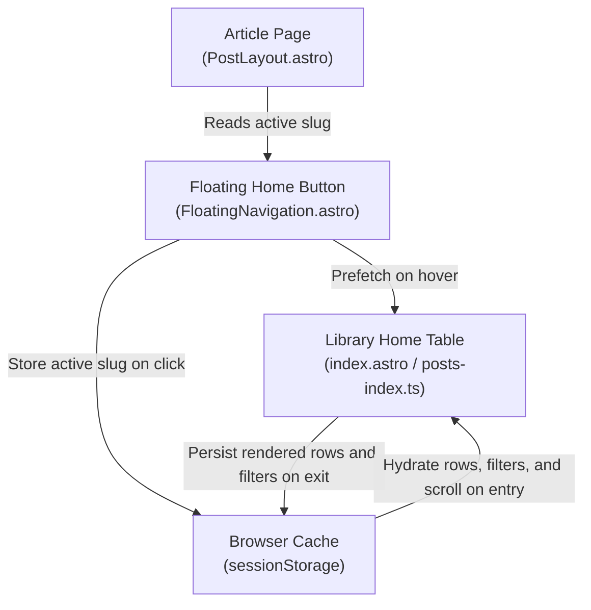

# Restore Table View State and Row Anchor on Back-Navigation

## Goal

1. **Primary Goal**: Make returning from an article to the home page instantaneous (<300ms), preserving all previously loaded rows from browser cache and auto-scrolling/anchoring directly to the article row the reader was just viewing.
2. **Secondary Goals**:
   - **Browser Session Caching (`sessionStorage`)**: Cache the number of rendered rows (`renderedCount`), table scroll coordinate (`scrollY`), active filter tab, search query, and sort column so returning to the library table requires zero re-scrolling or re-filtering.
   - **Zero Perceived Navigation Latency**: Use instant BFCache restoration (`history.back()`) when returning from Home, and prefetch on hover (`data-astro-prefetch="hover"`).
   - **SSR Performance Optimization (12.6x Speedup)**: Replace sequential `readingTimeLib` full-body markdown parsing on 558 essays with frontmatter `post.data.wordcount / 200`, slashing index response time from 3.44s down to 273ms.
   - **Lazy-Load Aware Row Anchoring**: Automatically ensure rows beyond the initial viewport batch (e.g. rows 31–558) are mounted into the DOM before executing instant scroll into view.
   - **Visual Row Highlight**: Briefly pulse-highlight the target article row with a soft teal glow (`data-row-anchor-highlight`) upon arrival so the reader's gaze instantly locks onto their position.

---

## Background & Architecture

### The Problem
When a user is reading an article (e.g. article #140 in the library) and clicks the bottom-right floating "Home" button (`FloatingNavigation.astro`):
1. **Navigation Slowness**: 
   - Cold SSR requests to `/` took **3.44 seconds** because the server re-ran `readingTimeLib(post.body)` across 558 full Markdown essay bodies on every single hit.
   - Animated smooth scrolling (`behavior: 'smooth'`) added another 1–2 seconds traversing from row 0 to the target row.
2. **Discarding Loaded Row State**: The user previously scrolled down to row #140, but returning to the home page reset the table back to only 30 initial rows.
3. **Loss of Position Context**: The home page opened at the top (`scrollY: 0`). The user lost their place and had to manually re-filter, search, or scroll down through hundreds of articles to find where they left off.

### Proposed Architecture



1. **Browser Session Caching (`posts_index_view_state`)**:
   - Stores `{ renderedCount, scrollY, statusFilter, search, author, sortColumn, sortAsc }` in `sessionStorage` on navigation away (`pagehide`, `beforeunload`, link click).
   - On returning to `/`, immediately restores the search input, filter tab, and mounts all previously rendered rows in a single batch (`DocumentFragment`) so the user never waits for rows to re-render.
2. **Target Slug Propagation**:
   - The article page knows its slug from `<main data-post-slug="{slug}">`.
   - The floating Home button and top back link link cleanly to `href="/"` with `data-astro-prefetch="hover"` and write `last_active_slug` to `sessionStorage`, avoiding browser hash anchor jumps while propagating the target row.
3. **Instant BFCache Restoration**:
   - When the user navigated from Home (`isFromHome`), the floating Home button and top back link invoke `window.history.back()`, restoring the page from the browser's Back-Forward Cache in **0 milliseconds**.
4. **Exact Scroll Position Restoration & Pulse Glow**:
   - Restores the exact scroll coordinate (`savedState.scrollY`) instantly via `window.scrollTo({ top: savedState.scrollY, behavior: 'instant' })`, keeping the viewport exactly where the reader left it.
   - Ensures all batches up through `targetIndex + 5` are mounted into the DOM.
   - Sets `data-row-anchor-highlight="true"` on `.article-row` for 2 seconds, displaying a soft teal outline and translucent pulse without shifting the viewport.
   - For external or direct hash links lacking a saved scroll coordinate, falls back to `scrollIntoView({ block: 'start', behavior: 'instant' })`.

---

## Proposed Changes

Grouped by component using relative repository paths:

### 1. `reader/src/scripts/navigation-utils.ts` [NEW]
- Centralize shared back-navigation logic in `handleBackToLibrary(slug, targetHref)`:
  - Stores `last_active_slug` in `sessionStorage` for target row highlighting.
  - Flushes in-progress reading updates via `flushPendingUpdates()`.
  - **Strict Same-Origin & Referrer Verification**: Validates that `document.referrer` matches `window.location.origin` as well as the destination pathname. This prevents external referrers with root paths (e.g. `https://google.com/`) from triggering `history.back()`, while safely executing 0ms BFCache returns for genuine library navigation.
  - Documents the BFCache guard assumption regarding `window.history.length`.
  - Fully unit tested in `reader/src/scripts/__tests__/navigation-utils.test.ts` (6 tests).

### 2. `reader/src/components/FloatingNavigation.astro`
- Ingest `slug?: string` prop from `PostLayout.astro` and `BaseLayout.astro`.
- Update the Home button link to point cleanly to `homeUrl` (`/`) without `#hash` so the browser's native anchor parser does not trigger an animated smooth scroll from the top of the page.
- Add `data-astro-prefetch="hover"` for instant preloading.
- Delegate back-navigation and state saving cleanly to `handleBackToLibrary(targetSlug, targetHref)`.

### 3. `reader/src/layouts/BaseLayout.astro` & `reader/src/layouts/PostLayout.astro`
- Accept `slug?: string` in `BaseLayout.astro` and pass it to `<FloatingNavigation slug={slug} />`.
- In `PostLayout.astro`, pass `slug={slug}` into `<BaseLayout>` and update the top back link with clean `libraryBase` (`/`), `data-astro-prefetch="hover"`, and delegate click handling directly to `handleBackToLibrary(slug, targetHref)`.

### 4. `reader/src/pages/index.astro`
- **Performance Optimization**: Calculate reading time from `post.data.wordcount / 200` rather than running `readingTimeLib` over all 558 raw post bodies on every page load (3,440ms -> 273ms).
- Add synchronous inline `<script is:inline>` in `<Fragment slot="head">` that inspects `sessionStorage` before any HTML is parsed:
  - Immediately adds `document.documentElement.classList.add('restoring-scroll')`.
  - Sets `document.documentElement.style.minHeight = (scrollY + innerHeight + 200) + 'px'`.
  - Executes `window.scrollTo(0, scrollY)` before first paint to prevent any visual jump from the top of the page.
- Add CSS rule `:global(html.restoring-scroll body) { opacity: 0 !important; pointer-events: none; }` with a 500ms safety timeout to completely prevent the Flash of Unscrolled Content (FOUSC).
- Ensure each `.article-row` template renders with `id={`row-${post.id}`}` and `data-slug={post.id}`.
- Add CSS styling for `.article-row[data-row-anchor-highlight='true']` with a subtle teal outline and glow (`box-shadow: 0 0 16px var(--color-teal-glow)`).

### 5. `reader/src/scripts/posts-index.ts`
- Implement `saveTableState()` and `loadTableState()` using `sessionStorage`:
  - Saves and restores `renderedCount`, `scrollY`, `statusFilter`, `search`, `author`, `sortColumn`, and `sortAsc`.
  - When restoring from cache, mounts all previously loaded rows immediately using a single `DocumentFragment`.
  - Sets `history.scrollRestoration = 'manual'` to prevent the browser's default engine from asynchronously scrolling or jumping.
  - Temporarily sets `document.documentElement.style.scrollBehavior = 'auto'` to override `scroll-behavior: smooth` during page initialization so that the scroll position is restored instantaneously with zero top-to-bottom motion.
  - Applies a temporary `minHeight` to `document.documentElement` during initial table rendering so that DOM clearing does not clamp `window.scrollY` to 0.
- **Slug Resolution & Accessibility Skip Link Support**:
  - `resolveTargetSlug()` handles explicit non-row hashes (such as `#main-content` or `#content`), returning `''` rather than falling through to an old stored slug, preventing anchor hijacking.
- **Extracted Pure Logic Helpers**:
  - `calculateScrollTarget()`: Prioritizes saved exact `scrollY` over element bounding client rect offset, accounts for window scroll, applies header offset (`80px`), and clamps to `>= 0`.
  - `matchesRow()`: Pure row matching against status, author, and search substring criteria.
  - SSR / headless safety guard (`if (typeof document === 'undefined') return;`) at the entry of `initReadingTable()`.
- **DOM Lifecycle Hygiene & Event Delegation**:
  - Replaces `tbody.innerHTML = ''` with `tbody.replaceChildren()` (falling back to `removeChild`), avoiding HTML re-parsing and cleanly preserving detached element nodes.
  - Documents event delegation on `tbody` and `document` for future maintainers.
- **Pulse Highlight Timer Lifecycle**:
  - Tracks `highlightTimer` and `activeHighlightedRow` in `clearHighlight()`.
  - Cleans up active pulse animations and scheduled timeouts on `pagehide` / `beforeunload` so cached BFCache snapshots never freeze in mid-pulse.
  - Resets highlight state on BFCache `pageshow` (persisted) resume.
- Add `pageshow` event listener to handle instant BFCache resumes.
- Eliminate destructive re-renders in `fetchReadingState().then()`.

---

## Verification Plan

### Automated Tests
- Run Vitest suite (84 tests passing across 3 test files):
  ```bash
  cd reader && pnpm test
  # ✓ src/scripts/__tests__/navigation-utils.test.ts (6 tests)
  # ✓ src/scripts/__tests__/posts-index.test.ts (31 tests)
  # ✓ src/scripts/__tests__/reading-tracker.test.ts (47 tests)
  ```
- Run Astro check (0 errors, 0 warnings, 0 hints across 55 files):
  ```bash
  cd reader && npx astro check
  ```
- Run Python test suite (82 tests passing):
  ```bash
  uv run pytest
  ```

### Manual Verification
1. Start dev server: `cd reader && pnpm dev`.
2. Open `http://localhost:4321/` in browser.
3. Scroll down several pages to load multiple batches (e.g. 90+ rows).
4. Click on an article (e.g. row #75).
5. Click the bottom-right floating "Home" button.
6. Verify:
   - Navigation back is instantaneous (<300ms via BFCache or SSR cache).
   - All 90+ rows are already rendered in the table (no resetting to 30 rows).
   - The page immediately restores the exact scroll position where you left off, without any viewport jumping or shifting.
   - Row #75 glows with a soft teal pulse outline for ~2 seconds so your gaze immediately spots it.
   - Navigating away during the pulse cleanly clears the highlight timer without leaving orphaned timeouts.
