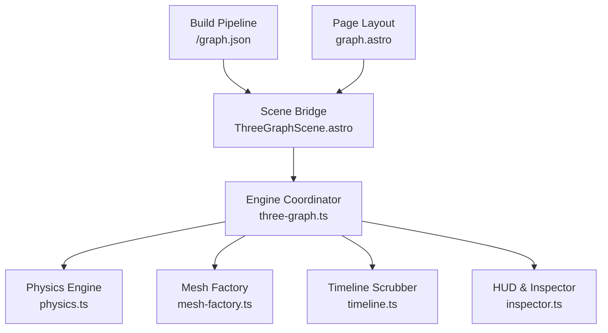

# 3D Interactive Knowledge Graph View (Constellation View)

## Goal

1. **Primary Goal**: Create a dedicated, interactive 3D Knowledge Graph page (`/graph`) in the Astro reader powered by Three.js, visualizing the entire newsletter library as an interconnected constellation of articles, topics/tags, and authors.
2. **Secondary Goal**: Enhance content discoverability beyond linear tables and lists, providing intuitive spatial clustering, real-time search filtering, tag isolating, reading status visualization, chronological timeline scrubbing, and smooth camera fly-to transitions directly into articles.

---

## Background & Architecture

The current reader provides two primary discovery modes:
1. **Library Page (`/`)**: A linear feed and tabular view with sorting (date, likes, length) and status filtering (unread, in-progress, completed).
2. **Search Page (`/search`)**: Full-text keyword search powered by Pagefind.

While effective for known lookups, these modalities do not expose the semantic fabric of the publication library—e.g., how distributed system architectures overlap with engineering leadership, or which topics bridge different authors.

Because `three` (`^0.186.0`) is already integrated into the Astro reader, we introduce a WebGL-accelerated 3D force-directed network view without adding heavy external dependencies, decomposed into modular TypeScript domain services.



### Architecture & Subsystem Matrix

| Subsystem / Layer | Module & Location | Role & Primary Responsibility | Upstream Inputs | Downstream Outputs |
| :--- | :--- | :--- | :--- | :--- |
| **Data Generation** | `src/pages/api/graph.json.ts`<br>[`graph-data.ts`](file:///f:/Codes/Substack2Markdown/reader/src/utils/graph-data.ts) | Statically compiles articles, topic tags, and author clusters into a unified node/link topology at build time. | Astro Content Collection (`posts`) | Static `/graph.json` payload |
| **Page Layout** | [`graph.astro`](file:///f:/Codes/Substack2Markdown/reader/src/pages/graph.astro)<br>[`graph.css`](file:///f:/Codes/Substack2Markdown/reader/src/styles/pages/graph.css) | Full-bleed viewport shell embedding layout, HUD overlay chrome, metadata headers, and global theme observers. | Route request (`/graph`) | DOM container & initial layout |
| **Scene Bridge** | [`ThreeGraphScene.astro`](file:///f:/Codes/Substack2Markdown/reader/src/components/ThreeGraphScene.astro) | Astro client component mounting the WebGL canvas, HUD controls (search, filters, timeline scrubber), and lifecycle teardown. | `/graph.json` + `graph.astro` | Canvas context & interactive HUD events |
| **Engine Coordinator** | [`three-graph.ts`](file:///f:/Codes/Substack2Markdown/reader/src/scripts/three-graph.ts) | Central WebGL orchestrator managing Three.js scene, `OrbitControls`, camera fly-to easing, raycasting, and 60 FPS animation loop. | `ThreeGraphScene.astro` | Dynamic 3D interactive knowledge constellation |
| **3D Physics Engine** | [`physics.ts`](file:///f:/Codes/Substack2Markdown/reader/src/scripts/graph/physics.ts) | Velocity Verlet force simulation computing $O(n^2)$ electrostatic repulsion, spring links, stride sampling, and alpha freeze threshold. | Node & link topology | Updated 3D particle positions `(x, y, z)` |
| **Geometric Taxonomy** | [`mesh-factory.ts`](file:///f:/Codes/Substack2Markdown/reader/src/scripts/graph/mesh-factory.ts) | Dual-theme geometry factory instantiating celestial bodies (dark) or architectural folios (light) with glow halos and edge lines. | `GraphNode` attributes & active theme | Three.js Meshes, BufferGeometries, Materials |
| **Temporal Scrubber** | [`timeline.ts`](file:///f:/Codes/Substack2Markdown/reader/src/scripts/graph/timeline.ts) | Chronological playback engine supporting date range filtering, play/pause historical growth playback, and active node bitmasks. | Publication ISO timestamps & UI slider | Filtered node visibility & alpha fades |
| **HUD & Tooltip** | [`inspector.ts`](file:///f:/Codes/Substack2Markdown/reader/src/scripts/graph/inspector.ts) | Glassmorphic HUD overlay and raycasting tooltip inspector displaying reading status, word counts, and fly-to CTA triggers. | Mouse pointer hover & click hits | Dynamic HTML HUD overlay card |

---

## Technical Specifications & Data Schema

### 1. Graph Data Contract (`/graph.json`)
Generated at build time from `getCollection('posts')`:

```typescript
export interface GraphNode {
  id: string;             // Unique slug or tag identifier (e.g. 'post:designing-data-intensive' or 'tag:system-design')
  title: string;          // Display label
  type: 'post' | 'tag' | 'author';
  group: string;          // Publication name or tag category for color clustering
  val: number;            // Node sphere radius/weight (proportional to word count or tag post frequency)
  url?: string;           // Direct navigation URL (for posts)
  date?: string;          // ISO date string
  readingTime?: number;   // Minutes
  readingStatus?: 'unread' | 'in-progress' | 'completed';
}

export interface GraphLink {
  source: string;         // Source node id
  target: string;         // Target node id
  weight?: number;        // Link strength (1.0 for tag match, higher for multi-tag or direct wikilinks)
  type: 'tag' | 'author' | 'crosslink';
}

export interface GraphData {
  nodes: GraphNode[];
  links: GraphLink[];
}
```

### 2. Physical Layout & Simulation (`reader/src/scripts/graph/physics.ts`)
- **Forces & Algorithmic Complexity**:
  - Many-body electrostatic repulsion (`chargeForce`) preventing node collapse.
  - Spring link force (`linkForce`) binding posts to tags and cross-linked posts.
  - Centering force (`centerForce`) keeping the constellation bounded within viewport boundaries.
  - **Repulsion Complexity & Scaling Limit**: Evaluated at $O(n^2)$ pairwise calculations per frame.
    - *Operational Target*: Optimized for catalogs $< 500$ posts (approx. $< 1,000$ total nodes including tags and publication hubs), delivering smooth 60 FPS on main thread.
    - *Stride Sampling*: Stride sub-sampling (`step = 2` when $n > 400$) reduces calculations to $\approx n^2 / 8$ (~75% reduction), avoiding frame drops during initial relaxation.
    - *Cooling Termination*: Once alpha cools below $\alpha < 0.005$, physics calculations short-circuit, dropping steady-state physics cost to $O(1)$.
    - *Scaling Limit & Future Roadmap*: For catalogs exceeding $> 1,000$ posts ($> 2,500$ nodes), upgrade to a 3D Barnes-Hut Octree ($O(n \log n)$) or offload relaxation to a Web Worker or WebGL compute shader.
  - Spring link force (`linkForce`) binding posts to tags and high-affinity cross-links ($O(|E|)$).
  - Centering gravity force (`centerForce`) bounding the constellation within viewport space ($O(n)$).
- **Simulation Stabilization**:
  - Pre-warmed for 55 synchronous ticks so initial visual frame is already clustered.
  - Dynamic relaxation with exponential alpha decay ($\alpha_{\text{decay}} = 0.988$) until freeze threshold ($\alpha < 0.005$).

### 3. Dual-Theme Shape Taxonomy (`reader/src/scripts/graph/mesh-factory.ts`)
The graph engine adopts a theme-responsive geometric taxonomy that visually distinguishes publication hubs, topic clusters, and articles:

| Theme | Publication Hubs (`author`) | Topic Hubs (`tag`) | Article Nodes (`post`) | Visual Philosophy |
| :--- | :--- | :--- | :--- | :--- |
| **Dark Mode** | **Ringed Planets** (`Sphere` + `RingGeometry`) | **Nebula Spheres** (`SphereGeometry`) | **Asteroids** (`DodecahedronGeometry`) | Deep cosmic observatory space with emissive celestial bodies and glowing orbital paths. |
| **Light Mode** | **Architectural Solid Spheres** (`SphereGeometry`) | **Prismatic Diamonds** (`OctahedronGeometry`) | **Document Folios** (`BoxGeometry`) | Clean editorial knowledge dendrogram with crisp slate/ink geometry on parchment canvas. |

### 4. Interactive 404 Aerospace Scene Duality (`reader/src/scripts/four-oh-four/`)
The 404 error experience is powered by a procedural Three.js aerospace engine featuring complete dark/light theme duality across vessels, resting attitudes, typography materials, and ambient space:

| Theme | Primary Vessel | Default Rest Attitude | 3D "404" Block Typography | Ambient Environment | Thematic Experience |
| :--- | :--- | :--- | :--- | :--- | :--- |
| **Dark Mode** | **SpaceX Starship**<br>Mirror-chrome stainless steel fuselage with articulating body flaps and glowing methalox engine plume | **Vertical Launchpad**<br>Stands upright towards zenith (`+Y`), ready for orbital launch into the cosmos | **Mirror-Chrome Steel**<br>Untouched Starship chrome with smooth 10-segment rounded bevels, high metalness ($1.0$), low roughness ($0.04$), reflecting environment studio lights | **Deep Cosmic Void**<br>Twinkling 2D canvas starfield and glowing blue space motes | **Orbital Rocket Launch**<br>High-G vertical thrust surge into supersonic deep space aerobatics |
| **Light Mode** | **Origami Paper Plane**<br>Duo-tone folded paper (cotton white top surface, craft slate gray underbelly `#64748b`) with crisp fold creases | **Aimed at "Search" CTA**<br>Glides angled down-left pointing directly at the Search button with $-20^\circ$ aerodynamic banking, showcasing both the top cotton paper wings and the bottom folding craft keel simultaneously in 3D origami perspective | **Origami Stationery Paper**<br>Duo-tone papercraft digits with 1-segment 45° chamfer folds, planar UV projection (wrapping ruled lines, margin, and fibers), warm archival stationery face (`#ede9e1`), craft slate chamfers (`#cbd5e1`), flat shading, zero metalness, zero envMap reflection, and `#334155` dark crease lines | **Clean Daylight Ether**<br>Subtle floating slate particles on off-white editorial parchment | **Tactile Paper Glider**<br>Playful origami dispatch guiding readers back to library search |

- **Continuous Extended 3D Flight Trajectory ($Z = -180$, $10.0\text{s}$)**: Both vessels share a 16-point centripetal Catmull-Rom aerobatic flight trajectory spanning over 360 spatial units into deep space/sky ($Z = -180$), lasting 10.0s (`FLIGHT_DURATION = 10.0`). The initial liftoff pitchover tilts snappily into horizontal flight attitude within ~0.8s ($u \le 0.028$) without sluggish dragging, enabling the craft to spend the vast majority of its journey (> 3.5s) soaring head-first outbound through the distant starfield before banking at $Z = -180$ and flying back.
- **Cinematic Asymmetric Background Motion (Option 2)**: The 2D starfield and 3D space motes dynamically synchronize with the vessel's 3D velocity vector (`computeFlightVelocity`). During outbound flight ($Z: 0 \to -180$, $v_z < 0$), warp speed and streaks accelerate into deep space. At the apogee turn ($Z = -180$), forward warp dissolves to zero while lateral banking parallax shifts the starfield center opposite the turn vector. On the return flyback ($Z: -180 \to 0$), the starfield remains at tranquil baseline drift, allowing the craft's exponential visual looming approach, engine landing burns, and flap flutter to take center stage without conflicting warp lines.
- **Interactive Mouse Aiming**: Vessels subtly track cursor coordinates with distance-based pitch/yaw blending, smoothly relaxing back to their default resting orientation when idle.

---

## Proposed Changes

### 1. Graph Data Utilities & Palette System (`reader/src/utils/graph-data.ts`, `reader/src/utils/graph-colors.ts`)
- Implemented `buildGraphData()` compiling articles, topics, and authors into a unified graph schema with semantic clustering and weights.
- Built procedural color and palette generation (`graph-colors.ts`) with theme awareness (dark/light mode adaptation, publication hues, tag tints).

### 2. Modular 3D Graph Engine (`reader/src/scripts/graph/`)
Decomposed the graph engine into focused, single-responsibility modules:
- [`physics.ts`](file:///f:/Codes/Substack2Markdown/reader/src/scripts/graph/physics.ts): Custom Velocity Verlet 3D force simulation with charge repulsion, spring links, bounding center gravity, and stride sampling.
- [`mesh-factory.ts`](file:///f:/Codes/Substack2Markdown/reader/src/scripts/graph/mesh-factory.ts): Dual-theme geometric taxonomy generating Ringed Planets, Nebula Spheres, and Asteroids for dark mode; Architectural Spheres, Prismatic Diamonds, and Document Folios for light mode.
- [`timeline.ts`](file:///f:/Codes/Substack2Markdown/reader/src/scripts/graph/timeline.ts): Chronological timeline scrubber with play/pause animations, date parsing, and time-range filtering.
- [`inspector.ts`](file:///f:/Codes/Substack2Markdown/reader/src/scripts/graph/inspector.ts): Glassmorphic HUD overlay and raycasting tooltip inspector with reading status indicators and metadata previews.
- [`types.ts`](file:///f:/Codes/Substack2Markdown/reader/src/scripts/graph/types.ts): Strongly typed graph contracts, simulation particles, and filter states.
- [`three-graph.ts`](file:///f:/Codes/Substack2Markdown/reader/src/scripts/three-graph.ts): Main WebGL coordinator managing `OrbitControls`, camera fly-to transitions, and event delegation.

### 3. Client-Side Reading Status Button Extraction (`reader/src/scripts/reading-status-button.ts`)
- Extracted inline client-side JavaScript from [`ReadingStatusButton.astro`](file:///f:/Codes/Substack2Markdown/reader/src/components/ReadingStatusButton.astro) into a standalone, testable TypeScript module.
- Handles reading status updates (`unread`, `in-progress`, `completed`), read count badges, and cross-tab/multi-instance event synchronization.

### 4. Visual Scene & HUD Component (`reader/src/components/ThreeGraphScene.astro`)
- Full-bleed canvas container with responsive HUD controls (search input, cluster filter pills, timeline scrubber, reset view button, status toggles).
- Subtle, streamlined top-left keybind hint badge (`Drag: rotate | Scroll: zoom | Click: inspect`).

### 5. Dedicated Graph Page (`reader/src/pages/graph.astro` & `reader/src/styles/pages/graph.css`)
- Dedicated `/graph` route with full-bleed layout.
- Glassmorphic HUD overlay styling with dark/light theme tokens and responsive controls.

### 6. Universal Topic Tag Palette Across Graph, Table & Article
- Integrated `getTagColors(tag)` across the ecosystem so topic tag pills in the 3D Graph (inspector tags and cluster badge), Library Table View (`.tag-pill`), and Article View (`.post-tags .tag-pill`, plus `.featured-post-card-category` in related posts) share the exact same deterministic, theme-aware palette (`CONSTELLATION_PALETTE` in dark mode, `ARCHITECTURAL_INK_PALETTE` in light mode).
- Enhanced related post cards in `reader/src/components/FeaturedPostGrid.astro` with increased inner padding (`var(--space-4) var(--space-4-5) var(--space-5)`), right-aligned publication date (`margin-left: auto`), and responsive category tag width to prevent premature truncation of multi-word tags.

### 7. Modular 404 Scene & Origami Paper Texture (`reader/src/scripts/four-oh-four/`)
- Decomposed 404 scene into `flight-trajectory.ts`, `starfield.ts`, `vessel-factory.ts`, and `types.ts`.
- Implemented complete dual-mode typography duality (`create3D404Typography`):
  - **Dark Mode**: Untouched Starship liquid chrome with smooth 10-segment rounded bevels (`metalness: 1.0`, `roughness: 0.04`, `envMapIntensity: 2.4`).
  - **Light Mode**: Handcrafted origami papercraft with 1-segment 45° chamfer folds, planar UV texture projection, warm stationery face (`#ede9e1`), craft cardstock chamfers (`#cbd5e1`), flat shading, zero metalness, zero envMap reflection, and `#334155` dark crease lines matching the paper plane.
- Re-angled default resting attitude from $-50^\circ$ to **$-20^\circ$** bank so both the upper cotton paper wings and the bottom folding craft keel are simultaneously visible in true 3D perspective.
- Extended aerobatic flight loop duration to **10.0s** (`FLIGHT_DURATION = 10.0`) with continuous smoothstep progress modeling (`computeFlightProgress`), snappy ~0.8s initial liftoff pitchover, and an extended outbound journey into deep space out to $Z = -180$ (> 360 spatial units).
- Implemented **Cinematic Asymmetric Background Motion (Option 2)**: Outbound flight accelerates 2D canvas stars and 3D space motes to warp speed, apex turn dissolves forward warp while providing banking camera parallax, and return flight maintains tranquil celestial drift while the craft looms exponentially into view.

---

## Verification Plan

### Automated Tests
- **Vitest Unit Tests**:
  ```bash
  cmd /c "nvs use lts && pnpm test"
  ```
  *(Result: 145/145 passed across 9 test suites: `reading-tracker`, `posts-index`, `graph-colors`, `graph-data`, `graph-physics`, `graph-timeline`, `reading-status-button`, `four-oh-four`, `navigation-utils`)*
- **TypeScript Compilation**:
  ```bash
  cmd /c "nvs use lts && pnpm tsc --noEmit"
  ```
  *(Result: 0 errors)*
- **Pytest Suite**:
  ```bash
  uv run pytest
  ```
  *(Result: 82/82 passed)*
- **Python Linting**:
  ```bash
  uv run ruff check .
  ```
  *(Result: All checks passed)*

### Manual Verification
- Verified 60 FPS smooth rotation, panning, and zoom navigation with OrbitControls.
- Verified node search filtering, cluster isolation, reading status filters, and smooth camera fly-to transitions.
- Verified chronological timeline scrubber filtering and playback animation.
- Verified responsive layout and dark/light theme transitions across both `/graph` and `/404`.
- Verified topic tag pills share identical colors across the 3D Graph, Library Table, and Article views.
- Verified duo-tone paper texture continuity between paper plane and 404 digits in light mode.
- Verified paper airplane resting attitude presents both the top wing and bottom folding keel simultaneously.
- Verified 10.0s flight loop with snappy ~0.8s initial pitchover, extended outbound cruise out to $Z = -180$, apex banking turn parallax, and smooth touchdown flare back to the resting pad.
