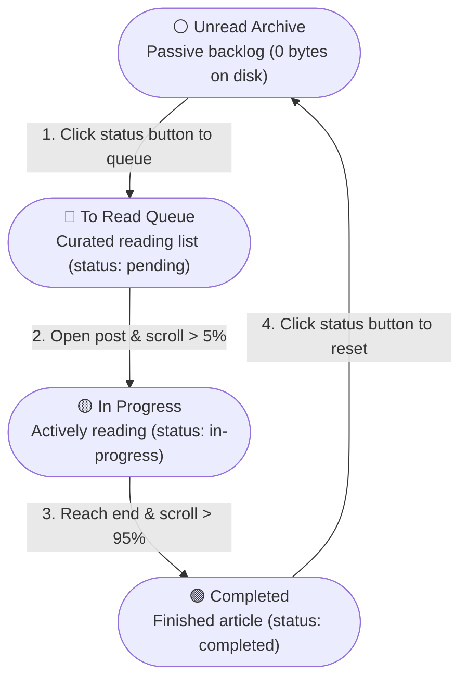

# Four-State Reading Queue with Zero-Schema-Change Persistence (stm-028)

## Goal

1. **Primary Goal**: Introduce a 4-state reading lifecycle that cleanly decouples the passive unread archive from the user's active, curated reading queue:
   - ⚪ **Unread**: Untouched archive articles (calm Slate Grey).
   - 🔴 **To Read**: User's curated reading queue (vibrant Coral Red `#e11d48` / `#ff453a`).
   - 🟡 **Reading**: Actively reading / in-progress (Amber Yellow `#c9a200` / `#facc15`).
   - 🟢 **Complete**: Finished reading (Emerald Green `#166534` / `#30d158`).
2. **Secondary Goals**:
   - **Zero-Schema-Change Backward Compatibility**: Preserve the existing schema of `content/reading_state.json` without migration. Untouched archive articles occupy 0 bytes on disk. Articles explicitly added to the queue are persisted as `"status": "pending"`.
   - **Dashboard Stoplight Triplet**: Bring the beloved **Red / Yellow / Green** stoplight triage triplet to the Stats Card and Status Filter Tabs without false urgency on 500+ untouched backlog posts.
   - **3D Graph Alignment**: In `/graph` reading status mode, explicitly queued "To Read" stars shine in soft coral red, while the untouched archive remains calm celestial slate.
   - **Seamless One-Click Cycling**: The status button cycles smoothly: `Unread (Slate)` ➔ `To Read (Red)` ➔ `Reading (Yellow)` ➔ `Complete (Green)` ➔ `Unread (Slate)`.

---

## Background & Architecture

### The Problem
Previously, the reading lifecycle had 3 states: `pending` ("To Read"), `in-progress` ("Reading"), and `completed` ("Complete").
Because any untouched article in the scraped library defaulted to `pending`, displaying "To Read" in Red resulted in 500+ screaming red alarms across the library. When "To Read" was changed to slate grey to calm the UI, the home page lost its energetic, satisfying **Red / Yellow / Green** triage triplet in the Stats Card and Filter Tabs.

Furthermore, in reality, there is a fundamental difference between:
1. **Unread Archive**: Articles stored in the local catalog that the user has not yet touched.
2. **To Read Queue**: The specific 3–5 articles the reader has actively chosen to read next.

### Proposed Lifecycle



### Lifecycle & Storage Matrix

| State | Stoplight Color | Storage in `reading_state.json` | Disk Footprint | Transition Trigger | Thematic & UX Purpose |
| :--- | :--- | :--- | :--- | :--- | :--- |
| **Unread** | ⚪ **Slate Grey** (`#64748b`) | *Omitted / absent from JSON* | **0 bytes** | Default state on scrape; or click reset from Complete | Passive archive backlog (500+ posts). Kept neutral to eliminate false urgency. |
| **To Read** | 🔴 **Coral Red** (`#e11d48` / `#ff453a`) | `{"status": "pending"}` | **~45 bytes** | Click "○ Unread" button | Curated reading queue. Brings back the high-priority Coral Red triage signal. |
| **Reading** | 🟡 **Amber Yellow** (`#c9a200` / `#facc15`) | `{"status": "in-progress", ...}` | **~120 bytes** | Scroll past 5% threshold, or click "To Read" | Actively reading. Tracks scroll depth, progress percentage, and last opened date. |
| **Complete** | 🟢 **Emerald Green** (`#166534` / `#30d158`) | `{"status": "completed", ...}` | **~120 bytes** | Scroll past 95% threshold, or click "Reading" | Finished reading. Increments read counter and unlocks re-read badge. |

### Dashboard Stoplight Triage

- **Total Articles**: Full library catalog count (neutral primary).
- **Unread**: Untouched passive archive posts (neutral slate grey).
- **To Read**: Explicitly queued articles (vibrant Coral Red).
- **Reading**: Articles currently in progress (Amber Yellow).
- **Completed**: Articles finished (Emerald Green).

---

## Proposed Changes

### 1. Core State Engine (`reader/src/scripts/reading-tracker.ts`)
- Update `ReadingStatus` type: `'unread' | 'pending' | 'in-progress' | 'completed'`.
- Update `getReadingStatus(slug)`: returns `'unread'` if untracked, `'pending'` if explicitly queued in state.
- Update `toggleReadingStatus(slug)`: cycles `unread` ➔ `pending` ➔ `in-progress` ➔ `completed` ➔ `unread`.
- On resetting from `completed` to `unread`, remove the entry from disk updates.

### 2. Status Button Component (`reader/src/components/ReadingStatusButton.astro`)
- Add `unread` visual state with `○ Unread` label and subtle slate outline.
- Add `pending` visual state with `🔖 To Read` label, Coral Red text, background, and border.
- Retain existing `in-progress` (`◑ Reading`) and `completed` (`✓ Complete`) states with reread badges.

### 3. Library Home Page & Controls (`reader/src/pages/index.astro`, `reader/src/scripts/posts-index.ts`)
- Display Coral Red counter for `stat-pending` ("To Read") and Emerald for "Completed".
- Filter tab `To Read` filters exclusively for queued (`pending`) articles.
- Filter tab `All` shows all articles.

### 4. 3D Knowledge Graph Integration (`reader/src/utils/graph-colors.ts`, `reader/src/scripts/three-graph.ts`)
- Map `pending` (To Read) nodes to soft Coral Red in reading-status mode.
- Map `unread` nodes to calm Slate Grey.

---

## Verification Plan

### Automated Tests
- Reader vitest test suite:
  ```bash
  nvs use lts; cd reader; pnpm test
  ```
- Astro diagnostics:
  ```bash
  nvs use lts; cd reader; pnpm check
  ```
- Scraper Python test suite & linting:
  ```bash
  uv run pytest
  uv run ruff check .
  ```

### Manual Verification
- Verify clicking button cycles: `Unread` ➔ `To Read` ➔ `Reading` ➔ `Complete` ➔ `Unread`.
- Verify `content/reading_state.json` updates cleanly without storing untouched articles.
- Verify Stats Card counters and Filter Tabs reflect the Red/Yellow/Green triage triplet.

