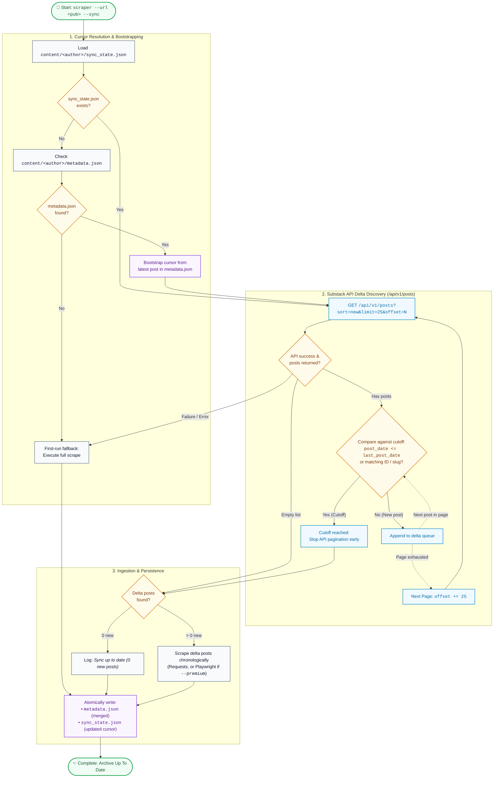

# Incremental Delta Sync via Substack API

## Goal

Add a `--sync` CLI flag that performs fast, incremental scraping — fetching and updating only posts published since the last sync. Instead of relying exclusively on `sitemap.xml` (which lists all historic URLs without timestamps and requires downloading/parsing hundreds of pages to check against disk), query Substack's public API (`/api/v1/posts`) sorted by newest first to detect the delta cutoff and stop pagination early.

---

## Background & Motivation

### Current Behavior
- [`BaseSubstackScraper.scrape_posts()`](../../scraper/scrapers/base.py) discovers candidate URLs via publication `sitemap.xml` (with `feed.xml` RSS fallback), filtering out static pages.
- While the scraper contains skip logic (`if self.overwrite or not os.path.exists(md_filepath)`), it still fetches the entire sitemap (often containing hundreds to thousands of entries) and iterates through every URL checking the local filesystem.
- For large publications (e.g. 500+ posts), full sitemap iteration and URL normalization take significant time even when no new posts have been published.

### Desired Behavior
Running:
```bash
uv run scraper --url https://example.substack.com --sync
```
should:
1. Load the publication's local sync cursor (`content/<author>/sync_state.json`) containing the timestamp and date of the most recent post scraped.
2. Query Substack's API (`/api/v1/posts?sort=new&limit=25`) for posts sorted descending by publication date.
3. Compare incoming post timestamps against the cursor (`last_post_date`).
4. Stop paginating immediately once an incoming post date is less than or equal to the recorded cursor date.
5. Scrape only the new delta posts (free via requests, premium via Playwright if `--premium` is enabled).
6. Atomically update the local cursor with the newest post date and sync timestamp upon successful completion.

---

## Substack API Endpoints & Response Specification

Substack exposes a public, unauthenticated JSON API endpoint for posts:

```http
GET {base_substack_url}api/v1/posts?offset=0&limit=25&sort=new
```

### Response Structure (Key Fields)
```json
[
  {
    "id": 12345678,
    "slug": "sample-post-slug",
    "title": "Sample Post Title",
    "subtitle": "An informative subtitle",
    "post_date": "2026-09-20T12:00:00.000Z",
    "canonical_url": "https://example.substack.com/p/sample-post-slug",
    "audience": "everyone",
    "wordcount": 2500,
    "description": "Article summary for SEO",
    "cover_image": "https://substackcdn.com/...",
    "tags": [{"name": "engineering"}, {"name": "ai"}],
    "truncated_body_text": "..."
  }
]
```

### Characteristics
- **Pagination**: Controlled via `offset` and `limit` (standard maximum 25 per request).
- **Ordering**: `sort=new` guarantees newest-first ordering, enabling immediate early termination.
- **Paywall / Premium Content**: For paid posts, the API returns rich metadata but a truncated body. For free posts or full markdown generation, the actual post URL `https://<pub>/p/<slug>` is scraped using the existing `extract_post_data()` or `PremiumSubstackScraper` browser pipeline.

---

## Architecture & Delta Detection Algorithm



---

## Proposed Solution & Design

### 1. Sync Cursor Storage (`content/<author>/sync_state.json`)

Stored in the author's root content directory alongside `metadata.json`:

```json
{
  "last_sync_at": "2026-09-27T10:00:00Z",
  "last_post_date": "2026-09-26T18:30:00.000Z",
  "last_post_id": 12345678,
  "last_post_slug": "openai-software-factory",
  "total_synced_posts": 142
}
```

- **`last_sync_at`**: ISO-8601 UTC timestamp of the last successful sync run.
- **`last_post_date`**: ISO-8601 string of the newest post published. Used as the primary cutoff threshold.
- **`last_post_id`**: Optional secondary guard against same-second publication edge cases.
- **`last_post_slug`**: Slug of the most recently synced post.

### 2. Cursor Management in `BaseSubstackScraper`

Add cursor helper methods:
- `_get_sync_state_path() -> str`: Returns `os.path.join(self.author_dir, "sync_state.json")`.
- `_parse_iso_datetime(date_str: str | None) -> datetime | None`: Parses ISO-8601 strings into UTC-aware datetime objects for robust chronological comparison.
- `_load_sync_state() -> dict[str, Any] | None`: Reads and deserializes `sync_state.json`, returning `None` if absent or corrupted. Bootstraps cursor from `metadata.json` if missing on legacy archives.
- `_save_sync_state(state: dict[str, Any]) -> None`: Atomically persists the updated sync cursor.

### 3. Paginated API Discovery (`_fetch_posts_from_api`)

```python
def _fetch_posts_from_api(
    self,
    since_date: str | None = None,
    last_post_id: int | None = None,
    last_post_slug: str | None = None,
    limit: int = DEFAULT_API_POST_LIMIT,
    max_pages: int = MAX_API_SYNC_PAGES,
) -> list[dict[str, Any]] | None:
    """Fetch post metadata records from Substack's public API until reaching cutoff date.

    Args:
        since_date: ISO date string cutoff. Pagination stops when post_date <= since_date.
        last_post_id: Post ID cutoff to stop at already synced post.
        last_post_slug: Post slug cutoff to stop at already synced post.
        limit: Number of posts per page (max 25).
        max_pages: Circuit-breaker safety limit for pagination loops.

    Returns:
        list[dict[str, Any]] | None: List of delta post records sorted newest to oldest, or None on API failure.
    """
```

- Constructs API URL using `self.base_substack_url`.
- Uses `requests.get` with standard `DEFAULT_REQUEST_TIMEOUT`.
- Evaluates `post["post_date"]`, `post["id"]`, and `post["slug"]`: terminates pagination immediately once reaching cutoff.
- Returns `None` on network or HTTP errors so `sync_posts` can cleanly distinguish 0 new posts from API failure.

### 4. Incremental Sync Orchestrator (`sync_posts`)

```python
def sync_posts(self) -> int:
    """Execute incremental delta synchronization for the publication.

    Returns:
        int: Number of new posts scraped during the sync.
    """
```

- Loads `sync_state.json`.
- If no cursor exists or author directory has no posts:
  - If existing posts exist on disk but no `sync_state.json` (legacy archive), inspect `content/<author>/metadata.json` to bootstrap `last_post_date` without re-scraping the whole archive!
  - Otherwise, run initial scrape.
- Fetches delta posts using `_fetch_posts_from_api(since_date=last_post_date, ...)`.
- If delta list is empty:
  - Log info: `"Sync up to date: 0 new posts found."`
  - Update `last_sync_at` in `sync_state.json` and exit.
- Constructs target post URLs from `post["canonical_url"]` or `self.base_substack_url + "p/" + post["slug"]`.
- Invokes extracted single-post scraper `_scrape_single_post(url, pbar)` for only the new delta posts in chronological order.
- Updates `metadata.json` and writes new `sync_state.json`.

### 5. CLI Integration & Flag Compatibility (`scraper/cli.py`)

- **Add `--sync` Argument**:
  ```python
  parser.add_argument(
      "--sync",
      action="store_true",
      help="Incremental delta sync: scrape only posts published since the last sync.",
  )
  ```
- **Flag Compatibility & Validation**:
  - **`--sync` with `--premium` (Fully Compatible)**: `--sync` controls *which* posts are fetched (scope / delta), while `--premium` controls *how* they are rendered (authenticated Playwright session). When combined (`--sync --premium`), the API detects new posts and the authenticated browser scrapes full paid content.
  - **`--sync` with `--number` / `-n` (Mutually Exclusive)**: Combining `--sync` with an arbitrary count limit risks corrupting the sync cursor (leaving intermediate posts permanently skipped). `cli.py` enforces mutual exclusivity with a helpful error:
    ```python
    if args.sync and args.number != 0:
        parser.error(
            "--sync cannot be combined with --number / -n. "
            "--sync automatically discovers and downloads all new posts published since the last sync."
        )
    ```
  - **`--sync` with Single-Post URLs (Mutually Exclusive)**:
    ```python
    if args.sync and is_post_url(args.url):
        parser.error("--sync can only be used with publication URLs, not individual post URLs.")
    ```
- **Execution Routing**:
  ```python
  if args.sync:
      scraper.sync_posts()
  else:
      scraper.scrape_posts(num_posts_to_scrape=args.number)
  ```

### 6. Resilience & Compatibility

- **Custom Domains**: Works seamlessly with custom publication domains (e.g. `newsletter.pragmaticengineer.com/api/v1/posts`) via `self.base_substack_url`.
- **API Failure Fallback**: If the API returns HTTP 404, 500, or invalid JSON, issue a warning and fall back to standard `sitemap.xml` / `feed.xml` URL discovery.
- **Premium Scraper Compatibility**: Inherited by `PremiumSubstackScraper`, allowing `--sync --premium` to discover delta URLs via lightweight API and scrape full paid contents via Playwright.

---

## Changes Required

- **[`scraper/config.py`](../../scraper/config.py)**:
  - Add API constants: `DEFAULT_API_POST_LIMIT = 25`, `MAX_API_SYNC_PAGES = 100`.
- **[`scraper/__init__.py`](../../scraper/__init__.py)**:
  - Re-export `DEFAULT_API_POST_LIMIT` and `MAX_API_SYNC_PAGES`.
- **[`scraper/scrapers/base.py`](../../scraper/scrapers/base.py)**:
  - Implement `_get_sync_state_path()`, `_parse_iso_datetime()`, `_load_sync_state()`, `_save_sync_state()`.
  - Implement `_fetch_posts_from_api()`.
  - Refactor `_scrape_single_post()`.
  - Implement `sync_posts()`.
- **[`scraper/cli.py`](../../scraper/cli.py)**:
  - Add `--sync` CLI flag.
  - Validate mutual exclusivity between `--sync` and `--number != 0`.
  - Validate `--sync` against single-post URLs.
  - Route execution to `scraper.sync_posts()`.
- **[`tests/test_scraper.py`](../../tests/test_scraper.py)**:
  - Unit tests for `_fetch_posts_from_api` pagination, cutoff conditions, and API failure.
  - Unit tests for `_load_sync_state`, `_save_sync_state`, and legacy `metadata.json` bootstrapping.
  - Tests for `--sync` argument parsing, `-n` conflict, and single-post conflict.
  - Integration tests for `sync_posts()` zero-delta and multi-post incremental updates.
- **[`.agents/README.md`](../README.md)**:
  - Register `stm-031` in Ticket Registry.

---

## Verification Plan

### Automated Tests
```bash
uv run pytest -v
uv run ruff check .
uv run ruff format --check .
```

### Manual Verification
1. **Live Incremental Delta Sync**:
   - Run `--sync` against a publication with an existing archive (e.g. `newsletter.pragmaticengineer.com`):
     ```bash
     uv run scraper --url https://newsletter.pragmaticengineer.com --sync
     ```
   - Verify:
     - Bootstraps sync state cursor from the latest entry in `content/<author>/metadata.json`.
     - Queries Substack API (`/api/v1/posts?sort=new&limit=25`) and halts pagination as soon as encountering posts older than the cursor cutoff.
     - Downloads only the new delta posts into `content/<author>/posts/<slug>.md`.
     - Updates `content/<author>/metadata.json` and records the new cursor in `content/<author>/sync_state.json`.

2. **Idempotent Re-Sync (Zero Delta)**:
   - Execute the same sync command a second time immediately:
     ```bash
     uv run scraper --url https://newsletter.pragmaticengineer.com --sync
     ```
   - Verify:
     - Output logs `Sync up to date: 0 new posts found.`
     - No existing posts or markdown files are re-downloaded.
     - `last_sync_at` in `sync_state.json` updates to the current timestamp while `last_post_date` remains unchanged.

3. **Incremental Sync with Image Assets**:
   - Run sync on a publication with `--images`:
     ```bash
     uv run scraper --url https://newsletter.pragmaticengineer.com --sync --images
     ```
   - Verify that any newly scraped delta posts download image assets locally into `content/<author>/images/<slug>/` and update markdown image links to relative paths.
