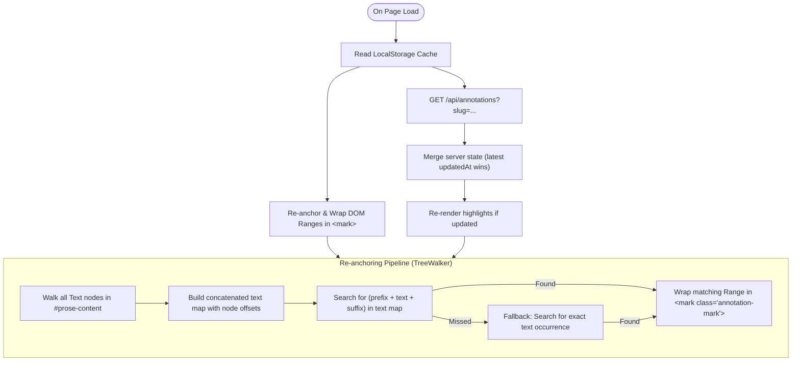

# Inline Highlighting & Annotations

## Goal

Enable readers to select text within any article in the local Astro reader, highlight it with a curated palette of semantic colors, attach personal margin notes, and persist annotations across sessions in `content/annotations.json`. Annotations are local-first, non-destructive, and can be reviewed in an in-page annotations drawer and exported for use in personal knowledge management (PKM) tools.

---

## Background & Motivation

Substack2Markdown archives newsletters into clean Markdown with an Astro reader for long-term study and reference. Currently, the reader provides reading queue and progress tracking (`stm-020`, `stm-028`), full-text Pagefind search, and a 3D knowledge graph (`stm-027`). However, there is no way for readers to annotate, highlight, or take notes on specific passages.

### Core Design Principles
1. **Local-first & Portable**: All annotations persist locally in `content/annotations.json` via dev server middleware, backed by a synchronous `localStorage` client cache for zero latency on navigation.
2. **Non-Destructive**: Annotations never modify the original `.md` or `.mdx` content files on disk.
3. **Robust Re-Anchoring**: Uses the W3C Web Annotation Data Model standard (`exact`, `prefix`, `suffix`) so highlights reliably re-anchor even if markdown formatting or whitespace shifts slightly across re-scrapes.
4. **Theme-Aware & Accessible**: Highlighting colors adapt seamlessly between light and dark modes using the reader's central token system (`tokens.css` and `colors.ts`).
5. **No Heavy Dependencies**: Lightweight implementation using native browser DOM `Selection`, `Range`, and `TreeWalker` APIs.

---

## Architectural Analysis & Integration

### Dev Server API Middleware vs. Static Output
In Astro's static mode (`output: 'static'`), file-based API routes in `src/pages/api/` require an SSR server adapter. Following the established pattern from `reading-tracker.ts` (`stm-020`):
- Dev server persistence is implemented as a **Vite middleware plugin** in [`reader/astro.config.mjs`](../../reader/astro.config.mjs).
- Middleware intercepts requests to `/api/annotations` (`GET`, `POST`, `DELETE`), reading and writing `content/annotations.json` directly on disk.
- When running in purely static preview mode (`astro preview`), the client gracefully operates from `localStorage` (`substack_annotations_cache_v1`).

---

## Proposed Solution & Design

### 1. Data Model (`content/annotations.json`)

Keyed by post ID (`<author>/posts/<slug>` matching `CollectionEntry<'posts'>['id']`):

```json
{
  "pragmaticengineer/posts/openai-software-factory": [
    {
      "id": "ann_m1n2o3p4",
      "text": "The key insight is that code review velocity...",
      "prefix": "In their engineering blog, ",
      "suffix": " which fundamentally changed...",
      "color": "yellow",
      "note": "Compare this with Google's approach in the DORA report",
      "createdAt": "2026-09-27T12:00:00.000Z",
      "updatedAt": "2026-09-27T12:05:00.000Z"
    }
  ]
}
```

#### Field Specifications
- **`id`**: Unique identifier string (`ann_<timestamp>_<random>`).
- **`text`**: Exact highlighted text string.
- **`prefix` / `suffix`**: Surrounding context (up to 32 characters) for deterministic `TextQuoteSelector` matching across DOM variations.
- **`color`**: Selection from semantic palette: `yellow`, `green`, `blue`, `pink`, `purple`.
- **`note`**: Optional commentary or markdown note attached to the highlight.
- **`createdAt` / `updatedAt`**: ISO-8601 UTC timestamps.

#### Why 32-Character Prefix & Suffix Context Window?
- **Disambiguating Identical Phrases**: Common phrases (e.g., `"engineering velocity"`, `"in this post"`) frequently appear multiple times in a single article. Storing just `"text"` makes it impossible to determine which instance was highlighted.
- **Statistical Uniqueness (~5-Gram)**: The average English word is ~5 characters (+ 1 space = 6 characters). A 32-character window captures 4 to 6 words of context. In computational linguistics, a 5-word sequence is statistically unique within a document, guaranteeing precise re-anchoring.
- **Resilience Against Re-scraping**: Unlike rigid character offsets (`startOffset: 1420`) or DOM XPaths which break if an author edits a typo in paragraph 1 or a promotional banner is stripped at the top of the post, the local sentence context (`prefix` and `suffix`) remains intact.
- **Storage & Robustness Sweet Spot**: 32 characters adds only ~32 bytes per highlight while avoiding overly large context windows (e.g. 100+ chars) where minor edits to nearby words would cause matching to fail.

---

### 2. Highlighting Palette & Aesthetic Decisions

- **Apple Books Aesthetic**: Follows the Books app visual language with 5 semantic tints (`yellow`, `green`, `blue`, `pink`, `purple`). Uses subtle translucent background washes for text highlights and matching solid circular swatches with inset rings in the toolbar.
- **Theme-Adaptive**: Tokens in [`reader/src/styles/tokens.css`](../../reader/src/styles/tokens.css) automatically calibrate opacity between light and dark modes to preserve WCAG AA text contrast.
- **Prose Mark Gradient Isolation**: Default `.prose mark` rules in `prose.css` rendered a bottom-38% blue gradient (`linear-gradient(transparent 62%, var(--prose-mark-bg) 0)`), which layered under annotation highlights as a faint blue stripe. Scoped typography styles to `.prose mark:not(.annotation-highlight)` and enforced `background-image: none !important` in `annotations.css`.

---

### 3. Selection Toolbar & Popover UI (`AnnotationToolbar.astro`)

- **Trigger**: Listens for `selectionchange` / `mouseup` / `touchend` within `#prose-content`.
- **Positioning**: Floats directly above or below the current selection coordinates using `window.getSelection().getRangeAt(0).getBoundingClientRect()`.
- **Actions**:
  - 5 circular color swatch buttons. Clicking any color immediately creates the highlight.
  - "Add Note" button: expands an inline markdown textarea.
  - "Remove Highlight" (when clicking an existing `<mark>` element).
- **Dismissal**: Clicking outside or pressing `Escape` clears the popover without saving.

---

### 4. DOM Re-Anchoring Algorithm (`annotations.ts`)



1. **TreeWalker Traversal**: Traverses all visible text nodes within `#prose-content`, ignoring `script`, `style`, and `.heading-anchor` nodes.
2. **Context Matching**:
   - Searches for `prefix + text + suffix`.
   - If exact context fails (e.g. slight punctuation change), falls back to exact text search with minimum distance heuristic.
3. **Range Wrapping**: Uses `Range.surroundContents` or splitting text nodes across boundaries to wrap matched characters in `<mark class="annotation-highlight" data-annotation-id="...">`.

---

### 5. In-Page Annotations Drawer & Dual-Access Navigation

- **Drawer & Slide-over Panel (`AnnotationsPanel.astro`)**:
  - Integrated into [`reader/src/layouts/PostLayout.astro`](../../reader/src/layouts/PostLayout.astro).
  - Lists all highlights in document order with color swatch badges.
  - Shows attached personal notes with timestamp.
  - Clicking any annotation smoothly scrolls `#prose-content` directly to the highlight and flashes an active pulse animation.
  - Quick actions to delete or copy markdown export of all highlights to clipboard.
- **Dual-Access Triggers**:
  - **Header Meta Badge**: Displays clickable highlight badge (e.g., `✏️ 3 notes`) beneath the title.
  - **Floating Navigation Dock (`FloatingNavigation.astro`)**: Persistent vertical column at bottom-right with auto-hiding behavior:
    - `Top` button: auto-hides near the top of the page (`scrollY <= 180px`), smoothly gliding in when reading mid-article.
    - `Notes` button: auto-hides when 0 notes exist, smoothly gliding in with a live count badge as soon as highlights are created.
    - Transitions use a graceful 365ms Apple easing curve (`cubic-bezier(0.16, 1, 0.3, 1)`), keeping the reading canvas completely distraction-free at page load.
    - Negative margins (`margin: -5px 0`) on collapsed buttons absorb the 10px flex gap to prevent layout jumping when toggling visibility.

---

### 6. Persistence & Dev API (`reader/astro.config.mjs`)

Extend Vite `configureServer` middleware in `reader/astro.config.mjs`:
- **`GET /api/annotations`**:
  - Optional `?slug=<post-id>` query parameter to filter by post, or returns full dictionary.
- **`POST /api/annotations`**:
  - Accepts JSON payload `{ slug, annotation }`.
  - Atomically merges into `content/annotations.json`.
- **`DELETE /api/annotations`**:
  - Accepts `{ slug, id }`.
  - Removes annotation from `content/annotations.json`.

---

## File Changes & Structure

### New Files
- `reader/src/scripts/annotations.ts`: Annotation manager, DOM Range tree-walker, localStorage sync, and API communication.
- `reader/src/server/plugins/annotations.ts`: Dedicated Vite dev server plugin providing annotations API endpoints.
- `reader/src/server/plugins/reading-state.ts`: Dedicated Vite dev server plugin providing reading status API endpoints.
- `reader/src/components/AnnotationToolbar.astro`: Floating selection popover with color pickers and note input.
- `reader/src/components/AnnotationsPanel.astro`: Side drawer / collapsible list of article notes.
- `reader/src/styles/components/annotations.css`: Apple Books highlight palette, borderless marks, and drawer styles.
- `reader/src/scripts/__tests__/annotations.test.ts`: Vitest test suite covering re-anchoring, serialization, CRUD, and merge logic.

### Modified Files
- `reader/astro.config.mjs`: Streamlined Astro configuration importing modular Vite dev server plugins.
- `reader/src/components/FloatingNavigation.astro`: Vertical floating dock with auto-hiding Notes and Top buttons and Apple easing transitions.
- `reader/src/layouts/PostLayout.astro`: Mount `AnnotationToolbar` and `AnnotationsPanel`, add highlight count to post meta header.
- `reader/src/styles/prose.css`: Exclude `.annotation-highlight` from default prose mark gradient.
- `reader/src/styles/tokens.css`: Add annotation highlight color tokens (Apple Books palette for light & dark).
- `reader/src/utils/colors.ts`: Add `ANNOTATION_COLORS` constant and type definitions.
- `.agents/README.md`: Register `stm-033` in ticket registry.

---

## Verification Plan

### Automated Tests
```bash
pnpm --dir reader test
pnpm --dir reader check
```
- Unit tests verifying:
  - Selection serialization (prefix, text, suffix extraction).
  - TreeWalker DOM re-anchoring across multi-node paragraphs.
  - LocalStorage caching and server state merge.
  - Annotation deletion and color updates.

### Manual Verification
1. **Highlighting Flow**:
   - Start reader with `pnpm dev`.
   - Open any article and select text in `#prose-content`.
   - Verify floating toolbar appears near cursor.
   - Click a color swatch (e.g. yellow) $\to$ text is immediately wrapped in yellow highlight.
2. **Note Attachment**:
   - Select text, click "Add Note", type a test note, and save.
   - Verify margin/popover displays note.
3. **Persistence Across Reloads**:
   - Refresh the page $\to$ highlight and note re-anchor immediately from `annotations.json`.
4. **Annotations Drawer**:
   - Click the note counter in header $\to$ verify drawer lists the highlight and smooth-scrolls to the passage on click.
5. **Theme Switching**:
   - Toggle dark/light mode $\to$ verify highlight colors maintain high legibility and appropriate background tint.
