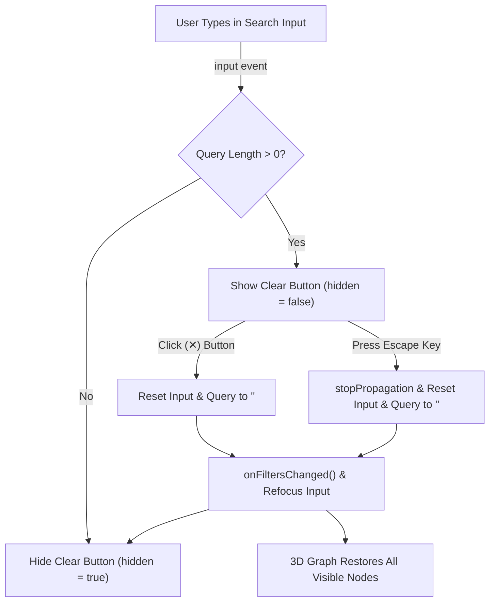

# Graph View Search Clear Button

## Goal

1. **Primary Goal**: Add a responsive, one-click clear (`✕`) button inside the 3D graph view search bar so readers can instantly reset node search filters without manually backspacing or deleting text.
2. **Secondary Goals**:
   - **Keyboard & Touch Accessibility**: Enable `Escape` key clearing with event propagation suppression (to avoid accidentally closing inspector drawers or dialogs), and ensure a $\ge 32\times32\text{px}$ touch target on mobile devices.
   - **Reactive State Synchronization**: Keep button visibility synchronized dynamically with input events, programmatic state updates, and browser session restoration (autofill/bfcache).
   - **Zero UI Disruption**: Suppress native WebKit search cancel decorations and preserve the clean glassmorphic HUD pill layout in both light and dark themes.

---

## Background & Architecture

In the 3D Constellation Knowledge Graph view ([`ThreeGraphScene.astro`](reader/src/components/ThreeGraphScene.astro)), the search bar allows filtering nodes by article title, publication author, and topic tags.

Previously, the search input was a plain text input without a clear button. Resetting an active search query required manually selecting and backspacing the text, which creates friction—particularly on touchscreens or when rapidly exploring different clusters in the 3D space.

### Interaction Flow



---

## Proposed Changes

### 1. Template Markup (`reader/src/components/ThreeGraphScene.astro`)

- Add the clear `<button>` with `data-graph-search-clear` and `hidden` attribute immediately after the `<input>` element inside `.graph-search-box`.
- Include an accessible SVG cross icon with `aria-hidden="true"` and `aria-label="Clear search"`.

```html
<button
  type="button"
  class="graph-search-clear"
  data-graph-search-clear
  aria-label="Clear search"
  hidden
>
  <svg
    width="14"
    height="14"
    viewBox="0 0 24 24"
    fill="none"
    stroke="currentColor"
    stroke-width="2.4"
    stroke-linecap="round"
    stroke-linejoin="round"
    aria-hidden="true"
  >
    <line x1="18" y1="6" x2="6" y2="18"></line>
    <line x1="6" y1="6" x2="18" y2="18"></line>
  </svg>
</button>
```

### 2. Centralized DOM Selectors (`reader/src/scripts/graph/selectors.ts`)

- Add `searchClearButton: '[data-graph-search-clear]'` to the `GRAPH_SELECTORS` registry to maintain parity between Astro templates and TypeScript controllers.

### 3. Client Filter Controller (`reader/src/scripts/graph/filters.ts`)

- Query `searchClearButtonElement` via `GRAPH_SELECTORS.searchClearButton`.
- Manage visibility using `updateClearButtonVisibility(searchQueryString: string)`:
  - Toggle `searchClearButtonElement.hidden = searchQueryString.length === 0`.
  - Check `searchInputElement.value` during initialization to handle browser autofill or bfcache restores.
- Implement `applySearchQueryValue(nextSearchQueryString: string, shouldRefocusInput: boolean)`:
  - Reset `activeSearchQuery` and `searchInputElement.value`.
  - Refocus `searchInputElement` when requested.
  - Update clear button visibility and notify subscribers via `onFiltersChanged()`.
- Add `click` listener to `searchClearButtonElement` calling `applySearchQueryValue('', true)`.
- Add `keydown` listener to `searchInputElement` for `Escape`:
  - If `activeSearchQuery.length > 0`, call `keyboardEvent.stopPropagation()` and `applySearchQueryValue('', true)`.
  - If already empty, permit default propagation (e.g. allowing drawer closure).
- Unregister all event listeners cleanly in `dispose()`.

### 4. Glassmorphic HUD & Mobile Styling (`reader/src/styles/pages/graph-controls.css`)

- Style `.graph-search-clear` with circular hover fill, focus visible ring, and explicit `[hidden] { display: none !important; }`.
- Ensure SVG stroke inherits button foreground color (`.graph-search-clear svg { color: inherit; }`).
- Suppress native browser search buttons via `.graph-search-input::-webkit-search-cancel-button { display: none; }`.
- Add touch target expansion to $\ge 32\times32\text{px}$ in `@media (max-width: 600px)` using a centered `::before` pseudo-element.

### 5. Unit Tests & Contract Verification (`reader/src/scripts/__tests__/graph-filters.test.ts`)

- Enhance `MockFilterElement` to support `hidden`, `isFocused`, `focus()`, `blur()`, and `dispatchKeyDown()`.
- Add test coverage for:
  - Button visibility toggling based on search query length.
  - Click-to-clear resetting query, dispatching filter updates, and refocusing input.
  - `Escape` key clearing with `stopPropagation()` when query is non-empty vs. no-op when empty.
  - Initial synchronization for pre-populated inputs.
  - Clean disposal of all registered event listeners.
- Verify `GRAPH_SELECTORS` template drift assertion includes the new clear button selector.

---

## Verification Plan

### Automated Tests
```bash
# 1. Run Vitest test suite
nvs use lts
cd reader
pnpm test

# 2. Type-checking and Astro build diagnostics
pnpm check
pnpm build

# 3. Python test suite and linter
uv run ruff check .
uv run pytest -v
```

### Manual Verification
1. Launch the reader: `cd reader && pnpm dev`.
2. Navigate to `http://localhost:4321/graph`.
3. In the top search bar, verify the clear button is initially hidden.
4. Type any search term (e.g., `"Distributed"`): verify nodes filter in 3D and the `✕` button appears.
5. Click the `✕` button: verify the search input is cleared, all nodes reappear in 3D, the input retains focus, and the `✕` button hides.
6. Type a term again and press `Escape`: verify the input clears and refocuses, while the node inspector drawer remains open.
7. Switch between Light and Dark modes: verify the button hover state, icon contrast, and focus ring render cleanly.
8. In responsive/mobile mode ($\le 600\text{px}$): verify the tap target is comfortable and does not disrupt the search pill height.
