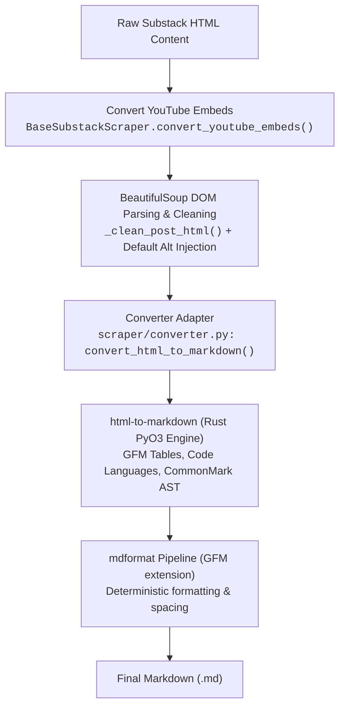

# HTML-to-Markdown Engine Migration

## Goal

1. **Primary Goal**: Migrate the Substack2Markdown conversion pipeline from the legacy, unmaintained `html2text` library to [`html-to-markdown`](https://github.com/xberg-io/html-to-markdown) (maintained by the Kreuzberg team, powered by a high-performance Rust core) to eliminate markdownlint violations, enhance table fidelity, and fix whitespace truncation around links.
2. **Secondary Goals**:
   - **Performance & Modern Typing**: Leverage Rust-backed PyO3 parsing throughput (19x–30x faster) with full PEP 585 / PEP 604 type safety and clean AST-based CommonMark & GFM compliance.
   - **Syntax Highlighting Out of the Box**: Preserve syntax highlighting language fences from both `<pre class="language-*">` and `<code class="language-*">` natively without fragile `HTML2Text` monkeypatching.
   - **Whitespace & Boundary Preservation**: Natively preserve boundary spaces in emphasized links (e.g. `*RSVP [via this link](...)*`), preventing text collisions.
   - **Decoupled Architecture**: Encapsulate converter configuration in a dedicated adapter module (`scraper/converter.py`), isolating conversion options from scraping orchestrators.

---

## Background & Architecture

### Evaluation Criteria & Library Comparison Matrix

| Dimension | `html2text` (Legacy) | `markdownify` | `html-to-markdown` (`xberg-io`) | Evaluation Verdict |
| :--- | :--- | :--- | :--- | :--- |
| **Maintenance Status (2026)** | ⚠️ **Stale** (Last release ~2020; unaddressed bugs & quirks) | ✅ **Active** (Frequent PyPI updates through 2025/2026) | ✅ **Highly Active** (Core engine maintained by Kreuzberg document intelligence team) | `html-to-markdown` wins on modern active maintenance and active upstream roadmap. |
| **Engine & Architecture** | Pure Python regex & custom token buffer | Pure Python over BeautifulSoup4 DOM | High-performance Rust core via Python native PyO3 bindings | `html-to-markdown` provides 19x–30x parsing throughput and memory efficiency. |
| **Standard Compliance** | Custom ASCII heuristics (MD004, MD007, MD027 violations) | Loose Markdown (heuristic tag mappings) | **Strict CommonMark & GFM** compliant | `html-to-markdown` eliminates systematic lint violations (MD027, MD004, MD012) at the source. |
| **Syntax Highlighting & Code Blocks** | Requires subclassing `handle_tag()` and `o()` to extract `language-(\w+)` | Customizable via `convert_pre()` & `convert_code()` | Native fenced code blocks with language tag extraction | `html-to-markdown` handles standard `<pre><code class="language-*">` out of the box. |
| **Table & GFM Support** | Rudimentary ASCII pipe tables; often breaks nested cells | Decent table support | **Full GFM table formatting** (cell padding, column alignment, pipe escaping) | `html-to-markdown` provides vastly superior tables for technical newsletter posts. |
| **Inline Whitespace & Links** | ❌ **Broken** (`self.stressed` strips spaces before `<a>`, e.g. `RSVPvia this link`) | ✅ Preserves boundary whitespace | ✅ **Strict CommonMark AST** (cleanly preserves boundary spaces in `<em>word <a href="...">link</a></em>`) | Resolves link whitespace under emphasis natively without regex hacks. |
| **Type Safety & Modern Python** | No type hints; untyped legacy API | Partial typing; loose kwargs | **Full MyPy strict type annotations**; modern functional interface | `html-to-markdown` conforms to PEP 585 / PEP 604 and modern typing standards. |
| **Dependencies & Portability** | Zero dependencies (pure Python) | Requires `beautifulsoup4` (already installed) | Compiled Rust wheel on PyPI (prebuilt for Windows, Linux, macOS x86_64/arm64) | Prebuilt binary wheels install seamlessly on Windows x64 via `uv`. |

### Conversion Pipeline Architecture



---

## Proposed Changes

### 1. Converter Adapter Module (`scraper/converter.py`)

- Create `scraper/converter.py` exporting `convert_html_to_markdown(html_content: str | None, default_image_alt: bool = True) -> str | None`. Returns `None` if the input is `None`, empty, whitespace-only, or conversion encounters an error.
- Configure `ConversionOptions` with:
  - `heading_style="atx"` (`#`)
  - `code_block_style="backticks"`
  - `wrap=False` (prevents artificial line breaking)
  - `autolinks=True`
- Handle default image `alt="image"` attribute normalization for MD045 compliance.

### 2. Base Scraper Integration (`scraper/scrapers/base.py`)

- Remove the legacy `SubstackHTML2Text` class and `import html2text`.
- Update `BaseSubstackScraper.html_to_md()` to call `convert_html_to_markdown(str(soup))`, safely guarding against `None` before passing to `mdformat.text(raw_markdown.strip(), extensions={"gfm"}).strip()` (returning `""` if `None` or empty).

### 3. Dependencies & Packaging (`pyproject.toml`)

- Add `html-to-markdown>=3.17.0` to dependencies.
- Remove `html2text` from dependencies.
- Update `uv.lock`.

### 4. Unit & Regression Tests (`tests/test_scraper.py`)

- Update code block language tests to verify `convert_html_to_markdown` output.
- Add tests for:
  - Fenced code block language extraction for both `<pre><code class="language-*">` and `<pre class="language-*">`.
  - GFM table conversion with proper header dividers.
  - Boundary whitespace preservation in emphasized links (`<em>text <a href="...">link</a></em>`).
  - Missing image alt normalization (``).
  - Empty, whitespace, and `None` input handling.
  - Clean `mdformat` integration.
- Replace legacy `import scraper as ss` with explicit `import scraper` across all test cases.
- Eliminate cryptic `ss` abbreviation, renaming shadowed test variables to `premium_scraper` and `fake_scraper`, and updating `_call_download_image()` in `scraper/images.py` to `scraper_module`.

### 5. Documentation (`AGENTS.md`)

- Update tech stack, dependencies, and architecture descriptions from `html2text` to `html-to-markdown`.

---

## Verification Plan

### Automated Tests
```bash
# 1. Python test suite
uv run pytest -v

# 2. Linting & formatting
uv run ruff check .
uv run ruff format --check .

# 3. Reader compilation & tests
nvs use lts
cd reader
pnpm test
pnpm check
pnpm build
```

### Manual Verification
1. Convert an HTML snippet with code blocks, tables, and emphasized links:
   ```bash
   uv run python -c "from scraper.converter import convert_html_to_markdown; print(convert_html_to_markdown('<table><tr><th>Col</th></tr><tr><td>Val</td></tr></table>'))"
   ```
2. Verify table pipe formatting, language fences, and spacing.
3. Run `uv run pytest -v` to ensure all 114+ tests pass.
