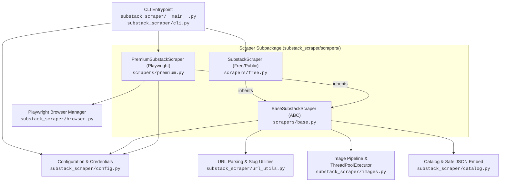
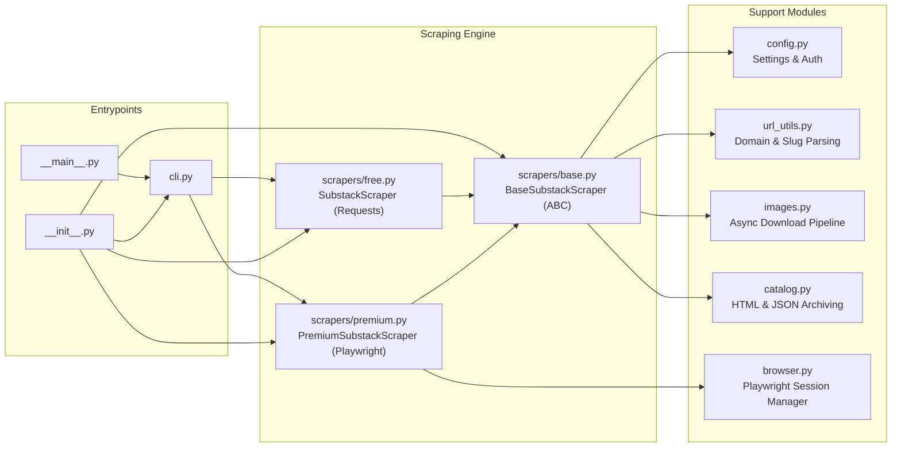

# Substack2Markdown - Project Guidelines & Context

## Project Overview
Substack2Markdown is a modular Python package designed to scrape and archive Substack newsletters (both free and premium subscriber-only content) into Markdown and HTML formats. It also provides a local HTML catalog interface with sorting capabilities (by date or like count) and downloads images locally when requested.

## Tech Stack & Architecture
- **Language & Standards**: Python 3.11+, PEP 8, PEP 585 (built-in generics), PEP 604 (union syntax `|`)
- **HTTP & Parsing**: `requests`, `BeautifulSoup` (bs4), `html2text`, `markdown`, `python-dotenv`
- **Automation / Headless Browser**: `playwright` (native Chrome and Edge channels, persistent sessions, CDP)
- **Testing**: `pytest`
- **Progress Tracking & Concurrency**: `tqdm`, `concurrent.futures.ThreadPoolExecutor`
- **Package Management**: `uv` with `pyproject.toml` and `uv.lock`

### Architecture & Module Interactions



### Module Responsibilities



- [`substack_scraper/config.py`](substack_scraper/config.py): Global scraping constants, root content directory (`BASE_CONTENT_DIR = "content"`), timeouts, and `get_credentials()` which loads from `.env` or environment variables.
- [`substack_scraper/url_utils.py`](substack_scraper/url_utils.py): URL validation, publication URL extraction, and `extract_main_part()` supporting custom Substack domains (e.g. `blog.bytebytego.com`, `newsletter.pragmaticengineer.com`).
- [`substack_scraper/catalog.py`](substack_scraper/catalog.py): `safe_json_embed()` (mitigating XSS vulnerabilities).
- [`substack_scraper/images.py`](substack_scraper/images.py): Image URL resolution, filename sanitization, linked image cleanup, and parallel downloads into `content/<author>/images/<slug>/` via `ThreadPoolExecutor`.
- [`substack_scraper/browser.py`](substack_scraper/browser.py): `BrowserManager` launching system Chrome and Edge directly via Playwright channels (`channel="chrome"`, `channel="msedge"`), persistent profiles, and CDP attach.
- [`substack_scraper/scrapers/base.py`](substack_scraper/scrapers/base.py): Abstract base class implementing URL discovery (sitemap.xml and feed.xml fallback), YouTube embed transformations, code syntax language preservation (`SubstackHTML2Text`), promotional widget & comment button stripping (`_clean_post_html`), rich metadata extraction (`window._preloads`), and author-centric storage (`content/<author>/posts/<slug>.md` and `metadata.json`).
- [`substack_scraper/scrapers/free.py`](substack_scraper/scrapers/free.py): Public post scraper using `requests` and `BeautifulSoup` with jittered exponential backoff on HTTP 429 errors.
- [`substack_scraper/scrapers/premium.py`](substack_scraper/scrapers/premium.py): Authenticated scraper for paid posts using Playwright, supporting session redirect detection, SSR hydration waits, persistent profiles, storage_state.json, and interactive CAPTCHA completion.
- [`substack_scraper/cli.py`](substack_scraper/cli.py): CLI argument parser and execution coordinator.
- [`reader/`](reader/): Static Astro reader based on Astro Tone, ingesting `../content/**/posts/*.{md,mdx}` with full-text search (Pagefind), tag filtering, syntax highlighting, and dark mode.
- [`tests/test_substack_scraper.py`](tests/test_substack_scraper.py): Comprehensive unit and integration test suite (82 tests).

## Project Structure & Outputs
- `content/<author>/posts/<slug>.md`: Scraped markdown files with rich YAML frontmatter.
- `content/<author>/images/<slug>/`: Downloaded post images (when `--images` is passed).
- `content/<author>/metadata.json`: Stored metadata (title, subtitle, author, date, cover image, post_id, tags, wordcount, audience, canonical_url).
- `reader/`: Local Astro static site reader.

## Setup & Environment
- Virtual environment is located at `.venv/`.
- Activate virtual environment:
  - Windows: `.\.venv\Scripts\activate`
  - POSIX: `source .venv/bin/activate`
- Install dependencies:
  ```bash
  uv sync
  # Or with pip: pip install .
  ```
- Substack credentials (for premium content):
  - Provide a `.env` file in the root (copy from `.env.example`), OR
  - Set environment variables `SUBSTACK_EMAIL` and `SUBSTACK_PASSWORD`.

## Common Commands
### Running the Scraper
- **Scrape free publication**:
  ```bash
  uv run substack_scraper --url https://example.substack.com
  # Or: python -m substack_scraper --url https://example.substack.com
  ```
- **Scrape single post**:
  ```bash
  uv run substack_scraper --url https://example.substack.com/p/post-slug
  ```
- **Scrape with images downloaded locally**:
  ```bash
  uv run substack_scraper --url https://example.substack.com --images
  ```
- **Scrape with raw promotional widgets (skip cleaning)**:
  ```bash
  uv run substack_scraper --url https://example.substack.com --no-clean
  ```
- **Scrape premium publication**:
  ```bash
  uv run substack_scraper --url https://example.substack.com --premium --browser chrome
  ```
- **Scrape premium with persistent profile (saves login/CAPTCHA state)**:
  ```bash
  # First run: log in or solve CAPTCHA interactively
  uv run substack_scraper --url https://example.substack.com --premium --persistent-profile
  # Subsequent runs:
  uv run substack_scraper --url https://example.substack.com --premium --persistent-profile --skip-login
  ```
- **Scrape premium by attaching directly to active browser (CDP)**:
  ```bash
  # Start Chrome with remote debugging: chrome.exe --remote-debugging-port=9222
  uv run substack_scraper --url https://example.substack.com --premium --cdp-url http://localhost:9222
  ```

### Running the Local Reader
- Start the Astro reader dev server:
  ```bash
  nvs use lts
  cd reader
  pnpm dev
  ```
- Build static reader and Pagefind search index:
  ```bash
  cd reader
  pnpm build
  pnpm preview
  ```

### Running Tests
- Execute test suite with pytest:
  ```bash
  uv run pytest -v
  # Or using venv directly
  .\.venv\Scripts\pytest
  ```

## Development Guidelines & Rules
1. **Preserve Compatibility**: Support both Chrome and Edge browser channels with automatic fallback, and both Windows and Unix path handling.
2. **Rate Limiting & Resilience**: Respect exponential backoff on HTTP 429 errors when requesting Substack endpoints.
3. **Security & Credentials**: Never hardcode or commit credentials. Maintain `.env` and `config.py` in `.gitignore`.
4. **Code Quality & Typing**: Follow PEP 8 guidelines, PEP 585 built-in generics (`list`, `dict`, `tuple`), and PEP 604 union types (`T | None`).
5. **Docstrings & Scope Visibility**: Any function or method whose caller is only within the same module or class must by default be protected with a `_` prefix (e.g. `_extract_post_id`, `_extract_metadata_from_md`). Only expose functions/methods as public (no `_` prefix) if they are intended to be called from another module. Use Google-style docstrings for public classes and functions, and concise one-line docstrings for protected (`_` prefixed) methods. Maintain callee-above-caller ordering.
6. **Documentation Integrity**: Use relative repository file paths in documentation (never absolute paths). Keep tests in `tests/test_substack_scraper.py` synchronized with all features and bugfixes.
7. **Test Mocking Conventions**: Use `Fake` as the naming prefix for test mock or stub classes rather than `Dummy` (e.g. `FakeScraper`).
8. **Linting and Formatting**: Always run `uv run ruff check .` and `uv run ruff format .` (or verify with `--check`) after making Python code changes to ensure linting and formatting compliance before proceeding.
9. **Commit Message Format**: Follow the standard Conventional Commit prefixes without component scopes (`type: description` instead of `type(scope): description`):
   - `feat:` New capabilities or user-facing features (routes to `.agents/plans/`).
   - `fix:` Bug fixes, crash prevention, input validation, safe defaults (routes to `.agents/issues/`).
   - `refactor:` Code reorganization without behavioral change (routes to `.agents/issues/`).
   - `perf:` Performance improvements, concurrency, caching (routes to `.agents/issues/`).
   - `security:` Security hardening, XSS prevention, credential safety (routes to `.agents/issues/`).
   - `docs:` Documentation changes only.
   - `test:` Test additions or test refactoring.
   - `build:` Dependencies, packaging, `pyproject.toml`, or `uv.lock`.
   - `chore:` Routine repository maintenance or configuration tweaks.


