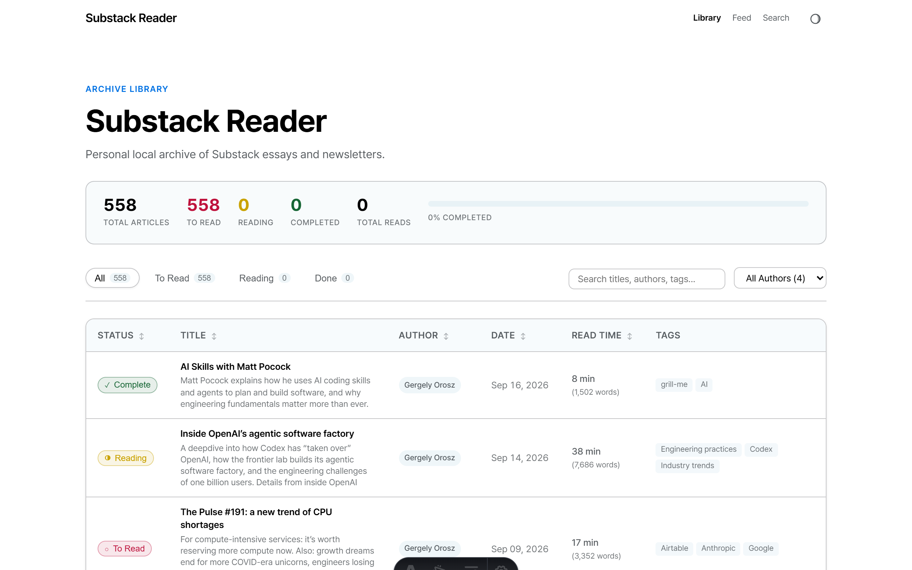
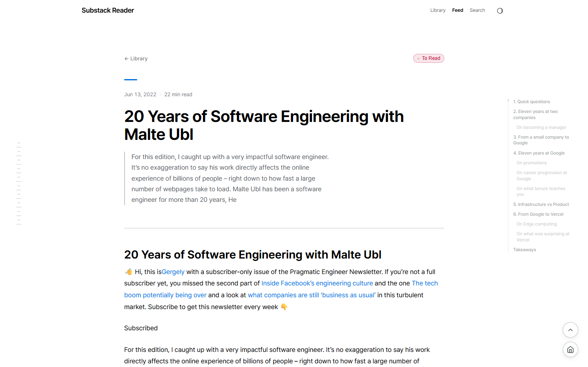

# Substack2Markdown

Substack2Markdown is a Python tool for downloading free and premium Substack posts and saving them into clean, structured Markdown files organized by author (`content/<author>/posts/<slug>.md`). It extracts rich post metadata, sanitizes promotional clutter, and powers a modern local static reader.

Once you run the scraper, it saves markdown files into `content/<author>/posts/` and an author catalog into `content/<author>/metadata.json`. When image downloading is enabled (`--images`), post images are saved locally into `content/<author>/images/<post_slug>/` and rewritten with relative links.

<p align="center">
  
</p>

## Features

### Scraping Engine
- **Free & Subscriber Content**: Archives public newsletters and paid subscriber-only posts (requires active subscription).
- **Clean Markdown & Frontmatter**: Converts posts to markdown with sanitized HTML, stripped promotional clutter (subscribe buttons, paywall banners, footers), and preserved code syntax blocks.
- **Rich Metadata Extraction**: Captures `post_id`, `tags`, `description`, `wordcount`, `audience`, and `canonical_url` with zero extra network overhead.
- **Local Asset Pipeline**: Downloads embedded images into `content/<author>/images/<slug>/` and rewrites markdown image links with `--images`.
- **Author-Centric Organization**: Cleanly arranges posts, images, and author catalog into `content/<author>/`.
- **Browser Automation & Session Reuse**: Launches desktop Chrome or Edge via Playwright with persistent profiles, storage state JSON, or CDP attach (solving CAPTCHAs interactively once and reusing sessions).
- **Flexible Scoping**: Scrapes entire publications, single posts by URL (e.g. `/p/slug`), or limits post count with `--number`.

### Modern Astro Reader (`reader/`)
- **Reading Progress & Tracker**: Todo-style status tracking (`pending`, `in-progress`, `completed`), read counters, completion progress bar, and persistence via local storage and `data/reading-state.json`.
- **Instant Back-Navigation & State Preservation**: Returns from articles with zero latency (BFCache), preserving loaded row batches, exact scroll coordinates, active filters, search queries, and pulse-highlighting the active post row.
- **Full-Text Search & Filtering**: Client-side search (Pagefind), author filtering, and multi-column sorting (status, title, author, date, length).
- **Reading Experience**: Dark mode support, image lightbox, syntax-highlighted code blocks, and floating navigation controls.

## Installation

Clone the repository and install dependencies using `uv` (recommended) or `pip`:

```bash
git clone https://github.com/0xfchen/Substack2Markdown.git
cd Substack2Markdown

# Install dependencies with uv (or pip install .)
uv sync
```

### Credentials Setup (For Premium Content)

To scrape subscriber-only posts, provide your Substack credentials using either of the following methods:

1. **`.env` file** in the project root (recommended, see `.env.example`):
   ```ini
   SUBSTACK_EMAIL=your-email@domain.com
   SUBSTACK_PASSWORD=your-password
   ```

2. **Environment variables**:
   ```bash
   export SUBSTACK_EMAIL="your-email@domain.com"
   export SUBSTACK_PASSWORD="your-password"
   ```

> The `.env` file is gitignored to ensure your credentials are never committed.

For premium scraping, you will also need either **Google Chrome** or **Microsoft Edge** installed.

## Usage

### Basic Scraping (Free Content)

Scrape an entire publication:
```bash
uv run scraper --url https://example.substack.com
# Or using python module:
python -m scraper --url https://example.substack.com
```

Scrape a single post directly:
```bash
uv run scraper --url https://example.substack.com/p/my-post
```

Limit the number of posts to scrape:
```bash
uv run scraper --url https://example.substack.com --number 5
```

Download images locally and rewrite markdown image links:
```bash
uv run scraper --url https://example.substack.com --images
```

Keep raw promotional widgets (disable cleaning):
```bash
uv run scraper --url https://example.substack.com --no-clean
```

Specify custom output base directory:
```bash
uv run scraper --url https://example.substack.com --directory /path/to/save/content
```

### Premium Scraping (Subscriber-Only Content)

Premium posts require subscriber access. Automation uses **Playwright** with zero driver setup, launching your desktop **Google Chrome** or **Microsoft Edge** directly.

Scrape premium content using Chrome or Edge:
```bash
uv run scraper --url https://example.substack.com --premium --browser chrome
```

#### Reusing Existing Sessions (No Repeated Logins)

**Option 1: Persistent Profile (Recommended)**
Saves your logged-in state to `~/.substack_scraper/<browser>_profile`:
```bash
# First run: logs in or solve CAPTCHA interactively once
uv run scraper --url https://example.substack.com --premium --persistent-profile

# Subsequent runs: reuse the session automatically
uv run scraper --url https://example.substack.com --premium --persistent-profile --skip-login
```

**Option 2: Storage State JSON**
Playwright automatically exports auth tokens and cookies to `~/.substack_scraper/storage_state.json` upon successful login:
```bash
# Run headlessly reusing saved cookies
uv run scraper --url https://example.substack.com --premium --headless --skip-login
# Or specify a custom state file:
uv run scraper --url https://example.substack.com --premium --storage-state path/to/state.json
```

**Option 3: Attach Directly to Active Browser (CDP)**
Connect directly to an already-open personal Chrome/Edge window without logging in again:
```bash
# 1. Start Chrome with remote debugging:
chrome.exe --remote-debugging-port=9222

# 2. Scrape directly using the active browser's tabs and cookies:
uv run scraper --url https://example.substack.com --premium --cdp-url http://localhost:9222
```

## Local Reader (Astro)

A modern static reader is provided in the `reader/` directory.

<p align="center">
  
</p>

To run the local reader:
```bash
cd reader
pnpm install
pnpm dev
```
Open [http://localhost:4321](http://localhost:4321) in your browser to read through all scraped newsletters with full search, tag filtering, and syntax highlighting.
